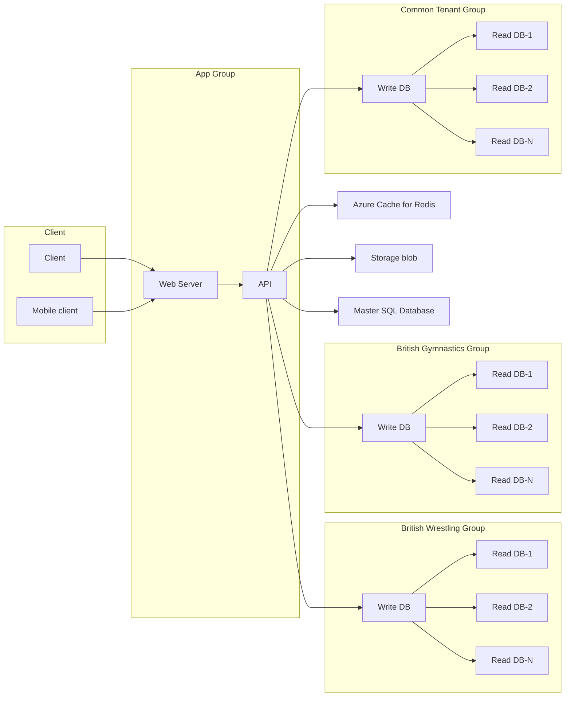

```mermaid
flowchart LR

%% Clients
subgraph Client
    C1[Client]
    C2[Mobile client]
end

%% App Group
subgraph "App Group"
    WS[Web Server]
    API[API]
end

%% Core Services
REDIS[Azure Cache for Redis]
BLOB[Storage blob]
MASTERDB[Master SQL Database]

%% British Wrestling Group
subgraph "British Wrestling Group"
    BW_R1[Read DB-1]
    BW_R2[Read DB-2]
    BW_RN[Read DB-N]
    BW_W[Write DB]
end

%% British Gymnastics Group
subgraph "British Gymnastics Group"
    BG_R1[Read DB-1]
    BG_R2[Read DB-2]
    BG_RN[Read DB-N]
    BG_W[Write DB]
end

%% Common Tenant Group
subgraph "Common Tenant Group"
    CT_R1[Read DB-1]
    CT_R2[Read DB-2]
    CT_RN[Read DB-N]
    CT_W[Write DB]
end

%% Relationships

%% Client -> App
C1 --> WS
C2 --> WS

%% Web Server -> API
WS --> API

%% API -> Core Services
API --> REDIS
API --> BLOB
API --> MASTERDB

%% API -> Tenant Write DBs
API --> BW_W
API --> BG_W
API --> CT_W

%% Read/Write DB relationships (replication style)
BW_W --> BW_R1
BW_W --> BW_R2
BW_W --> BW_RN

BG_W --> BG_R1
BG_W --> BG_R2
BG_W --> BG_RN

CT_W --> CT_R1
CT_W --> CT_R2
CT_W --> CT_RN
```
