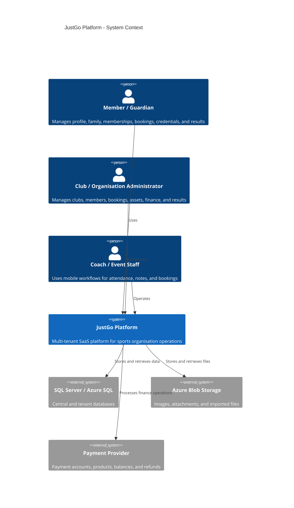
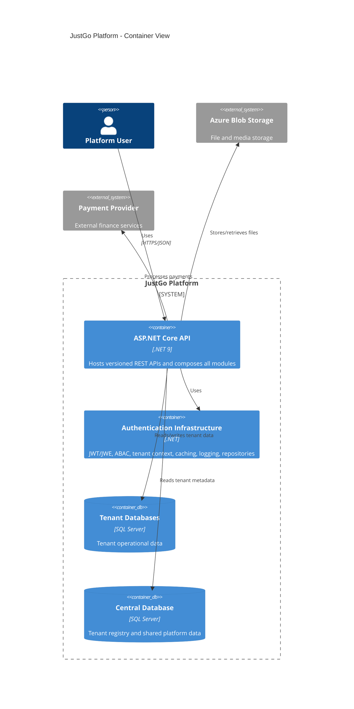

# Software Requirements Specification (SRS)

# JustGo Platform

## Document Control

### Document Information

| Field | Value |
| --- | --- |
| Title | Software Requirements Specification for JustGo Platform |
| Date | 2026-04-28 |
| Status | Draft |
| Version | 1.1 |
| Prepared for | JustGo Technologies Limited |
| Prepared by | Software Architecture Review |
| Reference | `docs\Annex-A-Detailed-Software-Requirements-Specification-SRS.pdf` |

Disclaimer:

This document is prepared from source-code observation and architectural review for internal analysis and stakeholder validation. It is not a signed product baseline until reviewed and approved by JustGo business owners, implementation leads, operations, security, and support representatives.

## Table of Contents

1. Introduction
2. Overall Description
3. System Features and Functional Requirements
4. External Interface Requirements
5. Non-Functional Requirements
6. Other Requirements
7. Endpoint Traceability Appendix

## Glossary

| Term | Definition |
| --- | --- |
| ABAC | Attribute-Based Access Control used to evaluate permissions from user, action, resource, and contextual attributes. |
| API | Application Programming Interface. |
| Club | A sports club or operating unit managed through JustGo. |
| CQRS | Command Query Responsibility Segregation, used by the platform to separate read and write use cases. |
| Endpoint Trace | A technical mapping row that links an observed API endpoint to a grouped business requirement. |
| JWT | JSON Web Token used for authenticated access. |
| Member | A person who participates in memberships, bookings, credentials, profiles, or results workflows. |
| MFA | Multi-Factor Authentication. |
| SRS | Software Requirements Specification. |
| Tenant | A customer organisation whose data and configuration are isolated from other organisations. |

## 1. Introduction

### 1.1. Purpose

This Software Requirements Specification (SRS) document provides a structured, business-readable description of the JustGo Platform, a multi-tenant SaaS application used by sports organisations to manage members, clubs, bookings, memberships, credentials, assets, finance, mobile workflows, and results.

The functional requirements in this version are grouped by business capability. Endpoint-level evidence is preserved in a separate traceability matrix and in Section 7 so that product owners can review intent while engineers can verify API coverage.

### 1.2. Document Conventions

| Term | Description |
| --- | --- |
| SHALL | Refers to a mandatory requirement that must be fulfilled by the system. |
| SHOULD | Indicates a recommended requirement that should be considered for current or near-future implementation. |
| MAY | Refers to an optional or future requirement that may be considered for subsequent phases. |
| TBD | To Be Determined; indicates information that requires stakeholder confirmation. |
| Note | Provides additional information or clarification. |

| Requirement Number | Description |
| --- | --- |
| FR-XXX | Grouped functional requirements mapped to one or more observed API endpoints. |
| EP-XXX | Endpoint trace identifiers used in the traceability matrix. |
| NFR-XX | Non-Functional Requirements |
| IR-XX | Interface Requirements |
| DR-XX | Data Requirements |
| SR-XX | Security Requirements |

### 1.3. Intended Audience

| Stakeholder | Role |
| --- | --- |
| JustGo Product Owners | Review the business fit and completeness of the stated capabilities. |
| JustGo Engineering Team | Use the requirements as a baseline for design, development, testing, and refactoring decisions. |
| Support and Operations Teams | Understand supported workflows, operational dependencies, and service expectations. |
| Security and Compliance Stakeholders | Review authentication, authorization, auditability, tenant isolation, and data protection expectations. |
| Customer Success and Implementation Teams | Use the document to explain product capabilities and implementation boundaries to customers. |

### 1.4. Project Scope

The JustGo Platform provides a modular SaaS backend for sports administration. Its scope includes tenant-aware identity and access control, member profile management, organisation and club management, booking and attendance operations, asset lifecycle activities, credential management, membership and licence visibility, finance and payment workflows, custom field configuration, mobile app support, and sports result management.

The scope of this SRS is limited to capabilities observable from the backend codebase. Detailed UI behavior, exact database stored procedure behavior, and final business policy wording require validation with product and domain stakeholders.

### 1.5. References

| Reference | Description |
| --- | --- |
| `docs\Annex-A-Detailed-Software-Requirements-Specification-SRS.pdf` | Reference SRS format used for this document. |
| Application source code | Backend modules used to infer business capabilities and functional requirements. |
| `docs/srs-endpoint-traceability-matrix.md` | Endpoint-level evidence, legacy endpoint FR text, review status, and grouped capability mapping. |
| `AGENTS.md` | Repository architecture and development guidance for module boundaries and implementation conventions. |
| `README.md` | Platform overview, technology stack, and setup guidance. |

## 2. Overall Description

### 2.1. Product Perspective

JustGo is a cloud-oriented, multi-tenant SaaS backend implemented as a .NET modular monolith. The system hosts multiple business modules behind versioned REST APIs, with shared authentication, authorization, repository, caching, logging, tenant, and file services.

Each tenant represents a customer organisation. The platform separates central tenant metadata from tenant operational data and uses the active tenant context to route database access appropriately.

### 2.2. Product Functions

At a high level, the JustGo Platform SHALL provide the following product functions:

- Manage user authentication, authorization, tenant access, MFA, permissions, and shared operational lookups.
- Manage member profile, family, emergency contact, note, preference, and media-related information.
- Manage clubs, organisation hierarchy, member-club relationships, join/leave workflows, transfer workflows, and primary club information.
- Manage memberships, licences, member entitlements, downloadable membership records, and membership-related catalogue information.
- Manage class, course, event, occurrence, attendance, eligibility, and booking workflows.
- Manage asset registers, asset credentials, asset licences, leases, ownership transfers, audits, tags, metadata, and status changes.
- Manage payment accounts, products, balances, subscriptions, instalments, finance grids, payment consoles, and refunds.
- Manage custom fields and tenant-specific metadata for extensible business data capture.
- Support mobile app experiences for clubs, events, classes, content, settings, MFA, attendance, notes, and booking operations.
- Manage result uploads, result-file lifecycle, sports results, competitions, events, rankings, player profiles, and validation workflows.

### 2.3. User Classes, Characteristics, and Needs

| User Class | Characteristics and Needs |
| --- | --- |
| Members and Guardians | Need self-service access to profile, family, emergency contact, membership, booking, credential, preference, and result information. |
| Club and Organisation Administrators | Need secure tools to manage clubs, members, bookings, attendance, assets, results, finance views, and operational configuration. |
| Coaches and Event Staff | Need mobile-friendly workflows for class and event attendance, attendee lists, notes, occurrence data, and booking validation. |
| Finance Users | Need visibility and control over payment accounts, products, balances, subscriptions, instalments, refunds, and finance grid views. |
| Platform Administrators | Need tenant, identity, MFA, lookup, permission, reference data, and support capabilities across the platform. |
| Implementation and Support Users | Need consistent diagnostics, documentation, audit information, and configuration visibility to support customers. |

### 2.4. Operating Environment

The observed implementation targets .NET 9, ASP.NET Core Web API, SQL Server or Azure SQL, Azure hosting patterns, JWT/JWE authentication, ABAC authorization, Serilog logging, Redis or hybrid cache components, Swagger/OpenAPI, Azure Blob based file storage, and external payment-provider integrations.

Source-code discovery found 502 endpoints across 67 controller files (v1.0: 400, v2.0: 69, v3.0: 70). These endpoints are mapped to 158 grouped functional requirements.

### 2.5. Design and Implementation Constraints

- The platform SHALL preserve module boundaries in the modular monolith architecture.
- Domain projects SHALL remain free of infrastructure and sibling module dependencies.
- Cross-module business coordination SHALL be performed through mediator-style requests rather than direct module coupling.
- Tenant context SHALL be resolved before tenant-specific data access.
- Inline SQL and stored procedure usage SHALL remain parameterized to protect data integrity and security.
- Public API behavior SHALL remain version-aware to support client evolution.

### 2.6. User Documentation

The system SHOULD be supported by user documentation for member self-service, club administration, booking operations, mobile attendance workflows, finance operations, asset administration, result management, MFA setup, and tenant onboarding. Technical documentation SHOULD include API usage, deployment, configuration, module boundaries, and troubleshooting guidance.

### 2.7. Assumptions and Dependencies

- Requirements reflect implemented backend API capabilities and may not capture all intended roadmap items.
- Business rules inside handlers, database objects, payment-provider configuration, and tenant-specific settings require additional stakeholder validation.
- The platform depends on SQL Server or Azure SQL, configured tenant databases, authentication secrets, external storage, payment services, and hosting infrastructure.
- Endpoint routes, HTTP verbs, controller file paths, and source line numbers are intentionally kept out of Section 3 and preserved in the traceability matrix instead.

## 3. System Features and Functional Requirements

This section describes grouped business capabilities. Each requirement maps to one or more observed backend endpoints; endpoint-level evidence is listed in `docs/srs-endpoint-traceability-matrix.md` and Section 7.

### 3.1. User Management and Authentication

Business scope: identity, login, tenant resolution, authorization, MFA, lookup data, shared notes, attachments, and user/security administration.

#### 3.1.1. Accounts

The system SHALL support accounts workflows within the User Management and Authentication feature area.

| ID | Requirement | Endpoint Trace IDs |
| --- | --- | --- |
| FR-001. | The system SHALL authenticate users, issue or refresh access tokens, and provide token-related session information so that users, administrators, and tenants can access the platform securely and consistently. | EP-005, EP-006, EP-014, EP-015 |
| FR-002. | The system SHALL support password recovery and password change workflows so that users, administrators, and tenants can access the platform securely and consistently. | EP-007, EP-008, EP-011, EP-012 |
| FR-003. | The system SHALL provide controlled technical utility operations for accounts so that users, administrators, and tenants can access the platform securely and consistently. | EP-009, EP-010, EP-013, EP-016 |

#### 3.1.2. Authorization

The system SHALL support authorization workflows within the User Management and Authentication feature area.

| ID | Requirement | Endpoint Trace IDs |
| --- | --- | --- |
| FR-004. | The system SHALL evaluate authorization and user-interface permissions for requested policies, actions, resources, and fields so that users, administrators, and tenants can access the platform securely and consistently. | EP-001, EP-002, EP-003, EP-004 |

#### 3.1.3. Cache Invalidation

The system SHALL support cache invalidation workflows within the User Management and Authentication feature area.

| ID | Requirement | Endpoint Trace IDs |
| --- | --- | --- |
| FR-005. | The system SHALL provide controlled technical utility operations for cache invalidation so that users, administrators, and tenants can access the platform securely and consistently. | EP-017, EP-018, EP-019, EP-020, EP-021, EP-022 |

#### 3.1.4. Files

The system SHALL support files workflows within the User Management and Authentication feature area.

| ID | Requirement | Endpoint Trace IDs |
| --- | --- | --- |
| FR-006. | The system SHALL allow authorized users to upload, preview, process, and manage files used by downstream workflows so that users, administrators, and tenants can access the platform securely and consistently. | EP-023, EP-024, EP-025, EP-026, EP-027, EP-028, EP-029, EP-030, EP-031, EP-032, EP-033, EP-034, EP-035, EP-036 |

#### 3.1.5. Lookup

The system SHALL support lookup workflows within the User Management and Authentication feature area.

| ID | Requirement | Endpoint Trace IDs |
| --- | --- | --- |
| FR-007. | The system SHALL provide reference lookup, metadata, status, field, and configuration data required by client workflows so that users, administrators, and tenants can access the platform securely and consistently. | EP-037, EP-038, EP-039, EP-040, EP-041 |

#### 3.1.6. Multi-Factor Authentication

The system SHALL support multi-factor authentication workflows within the User Management and Authentication feature area.

| ID | Requirement | Endpoint Trace IDs |
| --- | --- | --- |
| FR-008. | The system SHALL support multi-factor authentication enrollment, verification, one-time-password handling, and status management so that users, administrators, and tenants can access the platform securely and consistently. | EP-042, EP-043, EP-044, EP-045, EP-046, EP-047, EP-048, EP-049, EP-050, EP-051, EP-052, EP-053, EP-054, EP-055, EP-056 |

#### 3.1.7. Notes

The system SHALL support notes workflows within the User Management and Authentication feature area.

| ID | Requirement | Endpoint Trace IDs |
| --- | --- | --- |
| FR-009. | The system SHALL allow authorized users to create, review, update, and remove notes for shared notes so that users, administrators, and tenants can access the platform securely and consistently. | EP-057, EP-058, EP-059, EP-060, EP-061, EP-062 |

#### 3.1.8. System Settings

The system SHALL support system settings workflows within the User Management and Authentication feature area.

| ID | Requirement | Endpoint Trace IDs |
| --- | --- | --- |
| FR-010. | The system SHALL allow authorized users to search, filter, page, and review system settings records so that users, administrators, and tenants can access the platform securely and consistently. | EP-063 |

#### 3.1.9. Tenants

The system SHALL support tenants workflows within the User Management and Authentication feature area.

| ID | Requirement | Endpoint Trace IDs |
| --- | --- | --- |
| FR-011. | The system SHALL support tenants workflows so that users, administrators, and tenants can access the platform securely and consistently. | EP-064, EP-066, EP-067, EP-068, EP-070 |
| FR-012. | The system SHALL allow authorized users to create, submit, or process tenants records while preserving required business data so that users, administrators, and tenants can access the platform securely and consistently. | EP-065 |
| FR-013. | The system SHALL allow authorized users to update, remove, approve, cancel, archive, or otherwise change tenants lifecycle state so that users, administrators, and tenants can access the platform securely and consistently. | EP-069, EP-071 |

#### 3.1.10. User Interface Permissions

The system SHALL support user interface permissions workflows within the User Management and Authentication feature area.

| ID | Requirement | Endpoint Trace IDs |
| --- | --- | --- |
| FR-014. | The system SHALL evaluate authorization and user-interface permissions for requested policies, actions, resources, and fields so that users, administrators, and tenants can access the platform securely and consistently. | EP-072, EP-073, EP-074 |

#### 3.1.11. Users

The system SHALL support users workflows within the User Management and Authentication feature area.

| ID | Requirement | Endpoint Trace IDs |
| --- | --- | --- |
| FR-015. | The system SHALL support users workflows so that users, administrators, and tenants can access the platform securely and consistently. | EP-079, EP-080 |
| FR-016. | The system SHALL allow authorized users to create, submit, or process users records while preserving required business data so that users, administrators, and tenants can access the platform securely and consistently. | EP-075, EP-076, EP-077 |
| FR-017. | The system SHALL allow authorized users to update, remove, approve, cancel, archive, or otherwise change users lifecycle state so that users, administrators, and tenants can access the platform securely and consistently. | EP-078 |

### 3.2. Member Profile Management

Business scope: member profile, family, emergency contacts, preferences, notes, and member self-service profile workflows.

#### 3.2.1. Address Pickers

The system SHALL support address pickers workflows within the Member Profile Management feature area.

| ID | Requirement | Endpoint Trace IDs |
| --- | --- | --- |
| FR-018. | The system SHALL allow authorized users to create, submit, or process address pickers records while preserving required business data so that members and support users can maintain accurate personal, family, contact, and preference information. | EP-081 |

#### 3.2.2. Member Basic Details

The system SHALL support member basic details workflows within the Member Profile Management feature area.

| ID | Requirement | Endpoint Trace IDs |
| --- | --- | --- |
| FR-019. | The system SHALL allow authorized users to review detailed member basic details information so that members and support users can maintain accurate personal, family, contact, and preference information. | EP-083, EP-085 |
| FR-020. | The system SHALL allow authorized users to upload, preview, process, and manage files used by downstream workflows so that members and support users can maintain accurate personal, family, contact, and preference information. | EP-084 |
| FR-021. | The system SHALL allow authorized users to update, remove, approve, cancel, archive, or otherwise change member basic details lifecycle state so that members and support users can maintain accurate personal, family, contact, and preference information. | EP-082 |
| FR-022. | The system SHALL validate member basic details eligibility, rules, duplicates, or requested state changes and return clear outcomes so that members and support users can maintain accurate personal, family, contact, and preference information. | EP-086 |

#### 3.2.3. Member Family

The system SHALL support member family workflows within the Member Profile Management feature area.

| ID | Requirement | Endpoint Trace IDs |
| --- | --- | --- |
| FR-023. | The system SHALL support member family workflows so that members and support users can maintain accurate personal, family, contact, and preference information. | EP-089, EP-090, EP-092 |
| FR-024. | The system SHALL allow authorized users to create, submit, or process member family records while preserving required business data so that members and support users can maintain accurate personal, family, contact, and preference information. | EP-087 |
| FR-025. | The system SHALL allow authorized users to review detailed member family information so that members and support users can maintain accurate personal, family, contact, and preference information. | EP-091 |
| FR-026. | The system SHALL allow authorized users to update, remove, approve, cancel, archive, or otherwise change member family lifecycle state so that members and support users can maintain accurate personal, family, contact, and preference information. | EP-088, EP-093, EP-095 |
| FR-027. | The system SHALL allow authorized users to search, filter, page, and review member family records so that members and support users can maintain accurate personal, family, contact, and preference information. | EP-094 |

#### 3.2.4. Member Notes

The system SHALL support member notes workflows within the Member Profile Management feature area.

| ID | Requirement | Endpoint Trace IDs |
| --- | --- | --- |
| FR-028. | The system SHALL allow authorized users to create, review, update, and remove notes for member notes so that members and support users can maintain accurate personal, family, contact, and preference information. | EP-096, EP-097, EP-098, EP-099 |

#### 3.2.5. Members

The system SHALL support members workflows within the Member Profile Management feature area.

| ID | Requirement | Endpoint Trace IDs |
| --- | --- | --- |
| FR-029. | The system SHALL support members workflows so that members and support users can maintain accurate personal, family, contact, and preference information. | EP-102, EP-103, EP-104, EP-106, EP-108 |
| FR-030. | The system SHALL allow authorized users to create, submit, or process members records while preserving required business data so that members and support users can maintain accurate personal, family, contact, and preference information. | EP-107 |
| FR-031. | The system SHALL allow authorized users to review detailed members information so that members and support users can maintain accurate personal, family, contact, and preference information. | EP-100 |
| FR-032. | The system SHALL allow authorized users to update, remove, approve, cancel, archive, or otherwise change members lifecycle state so that members and support users can maintain accurate personal, family, contact, and preference information. | EP-101 |
| FR-033. | The system SHALL allow authorized users to search, filter, page, and review members records so that members and support users can maintain accurate personal, family, contact, and preference information. | EP-105 |

#### 3.2.6. Preferences

The system SHALL support preferences workflows within the Member Profile Management feature area.

| ID | Requirement | Endpoint Trace IDs |
| --- | --- | --- |
| FR-034. | The system SHALL support preferences workflows so that members and support users can maintain accurate personal, family, contact, and preference information. | EP-109, EP-110, EP-112 |
| FR-035. | The system SHALL allow authorized users to create, submit, or process preferences records while preserving required business data so that members and support users can maintain accurate personal, family, contact, and preference information. | EP-113, EP-114 |
| FR-036. | The system SHALL provide preferences lookup, metadata, status, field, and configuration data required by client workflows so that members and support users can maintain accurate personal, family, contact, and preference information. | EP-111 |

#### 3.2.7. User Emergency Contacts

The system SHALL support user emergency contacts workflows within the Member Profile Management feature area.

| ID | Requirement | Endpoint Trace IDs |
| --- | --- | --- |
| FR-037. | The system SHALL support user emergency contacts workflows so that members and support users can maintain accurate personal, family, contact, and preference information. | EP-117, EP-119 |
| FR-038. | The system SHALL allow authorized users to create, submit, or process user emergency contacts records while preserving required business data so that members and support users can maintain accurate personal, family, contact, and preference information. | EP-115 |
| FR-039. | The system SHALL allow authorized users to update, remove, approve, cancel, archive, or otherwise change user emergency contacts lifecycle state so that members and support users can maintain accurate personal, family, contact, and preference information. | EP-116, EP-118, EP-120 |

### 3.3. Organisation and Club Management

Business scope: clubs, organisation hierarchy, member organisation relationships, join/leave/transfer workflows, and primary club management.

#### 3.3.1. Organisations

The system SHALL support organisations workflows within the Organisation and Club Management feature area.

| ID | Requirement | Endpoint Trace IDs |
| --- | --- | --- |
| FR-040. | The system SHALL support organisations workflows so that members and administrators can manage club relationships, hierarchy, and transfer activities. | EP-122, EP-123, EP-125, EP-126, EP-127 |
| FR-041. | The system SHALL allow authorized users to review detailed organisations information so that members and administrators can manage club relationships, hierarchy, and transfer activities. | EP-128 |
| FR-042. | The system SHALL allow authorized users to update, remove, approve, cancel, archive, or otherwise change organisations lifecycle state so that members and administrators can manage club relationships, hierarchy, and transfer activities. | EP-121, EP-129 |
| FR-043. | The system SHALL provide organisations lookup, metadata, status, field, and configuration data required by client workflows so that members and administrators can manage club relationships, hierarchy, and transfer activities. | EP-124 |

### 3.4. Membership Management

Business scope: membership plans, licenses, family membership information, member entitlements, and downloadable membership artifacts.

#### 3.4.1. Memberships

The system SHALL support memberships workflows within the Membership Management feature area.

| ID | Requirement | Endpoint Trace IDs |
| --- | --- | --- |
| FR-044. | The system SHALL support memberships workflows so that members and organisations can understand entitlements, memberships, licences, and related downloadable records. | EP-132, EP-134 |
| FR-045. | The system SHALL allow authorized users to create, submit, or process memberships records while preserving required business data so that members and organisations can understand entitlements, memberships, licences, and related downloadable records. | EP-130 |
| FR-046. | The system SHALL allow authorized users to download or export memberships information in a usable form so that members and organisations can understand entitlements, memberships, licences, and related downloadable records. | EP-133 |
| FR-047. | The system SHALL allow authorized users to update, remove, approve, cancel, archive, or otherwise change memberships lifecycle state so that members and organisations can understand entitlements, memberships, licences, and related downloadable records. | EP-131, EP-135, EP-136 |

#### 3.4.2. Memberships Purchase

The system SHALL support memberships purchase workflows within the Membership Management feature area.

| ID | Requirement | Endpoint Trace IDs |
| --- | --- | --- |
| FR-048. | The system SHALL support memberships purchase workflows so that members and organisations can understand entitlements, memberships, licences, and related downloadable records. | EP-137, EP-138, EP-142 |
| FR-049. | The system SHALL provide memberships purchase lookup, metadata, status, field, and configuration data required by client workflows so that members and organisations can understand entitlements, memberships, licences, and related downloadable records. | EP-139 |
| FR-050. | The system SHALL allow authorized users to search, filter, page, and review memberships purchase records so that members and organisations can understand entitlements, memberships, licences, and related downloadable records. | EP-140, EP-141 |

### 3.5. Booking Management

Business scope: class, course, session, attendee, occurrence, eligibility, attendance, and profile booking operations.

#### 3.5.1. Booking Catalog

The system SHALL support booking catalog workflows within the Booking Management feature area.

| ID | Requirement | Endpoint Trace IDs |
| --- | --- | --- |
| FR-051. | The system SHALL allow authorized users to review, validate, and manage booking-related information for booking catalog so that members, coaches, and administrators can manage participation in classes, courses, events, and sessions. | EP-143, EP-144, EP-145, EP-146, EP-147, EP-148 |

#### 3.5.2. Booking Class

The system SHALL support booking class workflows within the Booking Management feature area.

| ID | Requirement | Endpoint Trace IDs |
| --- | --- | --- |
| FR-052. | The system SHALL allow authorized users to review, validate, and manage booking-related information for booking class so that members, coaches, and administrators can manage participation in classes, courses, events, and sessions. | EP-149, EP-150, EP-151, EP-152, EP-153, EP-154, EP-155, EP-156, EP-157, EP-158, EP-159 |

#### 3.5.3. Booking Pricing Chart Discount

The system SHALL support booking pricing chart discount workflows within the Booking Management feature area.

| ID | Requirement | Endpoint Trace IDs |
| --- | --- | --- |
| FR-053. | The system SHALL allow authorized users to review, validate, and manage booking-related information for booking pricing chart discount so that members, coaches, and administrators can manage participation in classes, courses, events, and sessions. | EP-160, EP-161, EP-162, EP-163, EP-164, EP-165 |

#### 3.5.4. Booking Transfer Request

The system SHALL support booking transfer request workflows within the Booking Management feature area.

| ID | Requirement | Endpoint Trace IDs |
| --- | --- | --- |
| FR-054. | The system SHALL allow authorized users to review, validate, and manage booking-related information for booking transfer request so that members, coaches, and administrators can manage participation in classes, courses, events, and sessions. | EP-166 |

#### 3.5.5. Class Management

The system SHALL support class management workflows within the Booking Management feature area.

| ID | Requirement | Endpoint Trace IDs |
| --- | --- | --- |
| FR-055. | The system SHALL support class management workflows so that members, coaches, and administrators can manage participation in classes, courses, events, and sessions. | EP-167, EP-168 |

#### 3.5.6. Class Term

The system SHALL support class term workflows within the Booking Management feature area.

| ID | Requirement | Endpoint Trace IDs |
| --- | --- | --- |
| FR-056. | The system SHALL allow authorized users to review, validate, and manage booking-related information for class term so that members, coaches, and administrators can manage participation in classes, courses, events, and sessions. | EP-170 |
| FR-057. | The system SHALL provide class term lookup, metadata, status, field, and configuration data required by client workflows so that members, coaches, and administrators can manage participation in classes, courses, events, and sessions. | EP-169 |

#### 3.5.7. Profile Class Booking

The system SHALL support profile class booking workflows within the Booking Management feature area.

| ID | Requirement | Endpoint Trace IDs |
| --- | --- | --- |
| FR-058. | The system SHALL allow authorized users to upload, preview, process, and manage files used by downstream workflows so that members, coaches, and administrators can manage participation in classes, courses, events, and sessions. | EP-171, EP-172 |

#### 3.5.8. Profile Course Booking

The system SHALL support profile course booking workflows within the Booking Management feature area.

| ID | Requirement | Endpoint Trace IDs |
| --- | --- | --- |
| FR-059. | The system SHALL allow authorized users to upload, preview, process, and manage files used by downstream workflows so that members, coaches, and administrators can manage participation in classes, courses, events, and sessions. | EP-173, EP-174, EP-175 |

### 3.6. Asset Management

Business scope: asset registers, asset categories, licenses, transfers, inspections, workflow status, and operational asset administration.

#### 3.6.1. Asset Audit

The system SHALL support asset audit workflows within the Asset Management feature area.

| ID | Requirement | Endpoint Trace IDs |
| --- | --- | --- |
| FR-060. | The system SHALL allow authorized users to search, filter, page, and review asset audit records so that asset owners and administrators can maintain controlled, auditable asset operations. | EP-176 |

#### 3.6.2. Asset Categories

The system SHALL support asset categories workflows within the Asset Management feature area.

| ID | Requirement | Endpoint Trace IDs |
| --- | --- | --- |
| FR-061. | The system SHALL provide asset categories lookup, metadata, status, field, and configuration data required by client workflows so that asset owners and administrators can maintain controlled, auditable asset operations. | EP-177 |

#### 3.6.3. Asset Checkout

The system SHALL support asset checkout workflows within the Asset Management feature area.

| ID | Requirement | Endpoint Trace IDs |
| --- | --- | --- |
| FR-062. | The system SHALL validate asset checkout eligibility, rules, duplicates, or requested state changes and return clear outcomes so that asset owners and administrators can maintain controlled, auditable asset operations. | EP-178, EP-179 |

#### 3.6.4. Asset Credentials

The system SHALL support asset credentials workflows within the Asset Management feature area.

| ID | Requirement | Endpoint Trace IDs |
| --- | --- | --- |
| FR-063. | The system SHALL support asset credentials workflows so that asset owners and administrators can maintain controlled, auditable asset operations. | EP-183, EP-184 |
| FR-064. | The system SHALL allow authorized users to create, submit, or process asset credentials records while preserving required business data so that asset owners and administrators can maintain controlled, auditable asset operations. | EP-182 |
| FR-065. | The system SHALL allow authorized users to update, remove, approve, cancel, archive, or otherwise change asset credentials lifecycle state so that asset owners and administrators can maintain controlled, auditable asset operations. | EP-185 |
| FR-066. | The system SHALL evaluate authorization and user-interface permissions for requested policies, actions, resources, and fields so that asset owners and administrators can maintain controlled, auditable asset operations. | EP-180 |
| FR-067. | The system SHALL provide asset credentials lookup, metadata, status, field, and configuration data required by client workflows so that asset owners and administrators can maintain controlled, auditable asset operations. | EP-181 |

#### 3.6.5. Asset Leases

The system SHALL support asset leases workflows within the Asset Management feature area.

| ID | Requirement | Endpoint Trace IDs |
| --- | --- | --- |
| FR-068. | The system SHALL allow authorized users to create, review, update, submit, approve, cancel, transfer, reinstate, or remove asset leases records so that asset owners and administrators can maintain controlled, auditable asset operations. | EP-195 |
| FR-069. | The system SHALL allow authorized users to create, submit, or process asset leases records while preserving required business data so that asset owners and administrators can maintain controlled, auditable asset operations. | EP-186, EP-189 |
| FR-070. | The system SHALL allow authorized users to review detailed asset leases information so that asset owners and administrators can maintain controlled, auditable asset operations. | EP-190 |
| FR-071. | The system SHALL allow authorized users to review asset leases history, activity, and audit information so that asset owners and administrators can maintain controlled, auditable asset operations. | EP-192, EP-193 |
| FR-072. | The system SHALL allow authorized users to update, remove, approve, cancel, archive, or otherwise change asset leases lifecycle state so that asset owners and administrators can maintain controlled, auditable asset operations. | EP-191 |
| FR-073. | The system SHALL evaluate authorization and user-interface permissions for requested policies, actions, resources, and fields so that asset owners and administrators can maintain controlled, auditable asset operations. | EP-187 |
| FR-074. | The system SHALL provide asset leases lookup, metadata, status, field, and configuration data required by client workflows so that asset owners and administrators can maintain controlled, auditable asset operations. | EP-188, EP-194 |

#### 3.6.6. Asset Licenses

The system SHALL support asset licenses workflows within the Asset Management feature area.

| ID | Requirement | Endpoint Trace IDs |
| --- | --- | --- |
| FR-075. | The system SHALL allow authorized users to create, submit, or process asset licenses records while preserving required business data so that asset owners and administrators can maintain controlled, auditable asset operations. | EP-196, EP-197, EP-202 |
| FR-076. | The system SHALL allow authorized users to update, remove, approve, cancel, archive, or otherwise change asset licenses lifecycle state so that asset owners and administrators can maintain controlled, auditable asset operations. | EP-199, EP-204, EP-205 |
| FR-077. | The system SHALL evaluate authorization and user-interface permissions for requested policies, actions, resources, and fields so that asset owners and administrators can maintain controlled, auditable asset operations. | EP-198 |
| FR-078. | The system SHALL provide asset licenses lookup, metadata, status, field, and configuration data required by client workflows so that asset owners and administrators can maintain controlled, auditable asset operations. | EP-201, EP-203, EP-206, EP-207, EP-208, EP-209 |
| FR-079. | The system SHALL validate asset licenses eligibility, rules, duplicates, or requested state changes and return clear outcomes so that asset owners and administrators can maintain controlled, auditable asset operations. | EP-200 |

#### 3.6.7. Asset Metadata

The system SHALL support asset metadata workflows within the Asset Management feature area.

| ID | Requirement | Endpoint Trace IDs |
| --- | --- | --- |
| FR-080. | The system SHALL provide reference lookup, metadata, status, field, and configuration data required by client workflows so that asset owners and administrators can maintain controlled, auditable asset operations. | EP-210, EP-211, EP-212, EP-213, EP-214, EP-215, EP-216, EP-217, EP-218, EP-219, EP-220 |

#### 3.6.8. Asset Ownership Transfers

The system SHALL support asset ownership transfers workflows within the Asset Management feature area.

| ID | Requirement | Endpoint Trace IDs |
| --- | --- | --- |
| FR-081. | The system SHALL allow authorized users to create, submit, or process asset ownership transfers records while preserving required business data so that asset owners and administrators can maintain controlled, auditable asset operations. | EP-223 |
| FR-082. | The system SHALL allow authorized users to review detailed asset ownership transfers information so that asset owners and administrators can maintain controlled, auditable asset operations. | EP-224 |
| FR-083. | The system SHALL allow authorized users to review asset ownership transfers history, activity, and audit information so that asset owners and administrators can maintain controlled, auditable asset operations. | EP-225, EP-226 |
| FR-084. | The system SHALL evaluate authorization and user-interface permissions for requested policies, actions, resources, and fields so that asset owners and administrators can maintain controlled, auditable asset operations. | EP-221 |
| FR-085. | The system SHALL provide asset ownership transfers lookup, metadata, status, field, and configuration data required by client workflows so that asset owners and administrators can maintain controlled, auditable asset operations. | EP-222, EP-227 |

#### 3.6.9. Asset Registers

The system SHALL support asset registers workflows within the Asset Management feature area.

| ID | Requirement | Endpoint Trace IDs |
| --- | --- | --- |
| FR-086. | The system SHALL allow authorized users to create, review, update, submit, approve, cancel, transfer, reinstate, or remove asset registers records so that asset owners and administrators can maintain controlled, auditable asset operations. | EP-231, EP-235, EP-238, EP-239 |
| FR-087. | The system SHALL allow authorized users to create, submit, or process asset registers records while preserving required business data so that asset owners and administrators can maintain controlled, auditable asset operations. | EP-232 |
| FR-088. | The system SHALL allow authorized users to review detailed asset registers information so that asset owners and administrators can maintain controlled, auditable asset operations. | EP-234 |
| FR-089. | The system SHALL allow authorized users to update, remove, approve, cancel, archive, or otherwise change asset registers lifecycle state so that asset owners and administrators can maintain controlled, auditable asset operations. | EP-233 |
| FR-090. | The system SHALL provide asset registers lookup, metadata, status, field, and configuration data required by client workflows so that asset owners and administrators can maintain controlled, auditable asset operations. | EP-229, EP-240 |
| FR-091. | The system SHALL allow authorized users to search, filter, page, and review asset registers records so that asset owners and administrators can maintain controlled, auditable asset operations. | EP-228, EP-236, EP-237 |
| FR-092. | The system SHALL validate asset registers eligibility, rules, duplicates, or requested state changes and return clear outcomes so that asset owners and administrators can maintain controlled, auditable asset operations. | EP-230 |

#### 3.6.10. Asset Reports

The system SHALL support asset reports workflows within the Asset Management feature area.

| ID | Requirement | Endpoint Trace IDs |
| --- | --- | --- |
| FR-093. | The system SHALL support asset reports workflows so that asset owners and administrators can maintain controlled, auditable asset operations. | EP-241 |
| FR-094. | The system SHALL allow authorized users to download or export asset reports information in a usable form so that asset owners and administrators can maintain controlled, auditable asset operations. | EP-242 |

#### 3.6.11. Asset Types

The system SHALL support asset types workflows within the Asset Management feature area.

| ID | Requirement | Endpoint Trace IDs |
| --- | --- | --- |
| FR-095. | The system SHALL provide asset types lookup, metadata, status, field, and configuration data required by client workflows so that asset owners and administrators can maintain controlled, auditable asset operations. | EP-243, EP-244 |

#### 3.6.12. Clubs

The system SHALL support clubs workflows within the Asset Management feature area.

| ID | Requirement | Endpoint Trace IDs |
| --- | --- | --- |
| FR-096. | The system SHALL support clubs workflows so that asset owners and administrators can maintain controlled, auditable asset operations. | EP-245, EP-247, EP-249 |
| FR-097. | The system SHALL allow authorized users to review detailed clubs information so that asset owners and administrators can maintain controlled, auditable asset operations. | EP-246 |
| FR-098. | The system SHALL provide clubs lookup, metadata, status, field, and configuration data required by client workflows so that asset owners and administrators can maintain controlled, auditable asset operations. | EP-248 |

#### 3.6.13. Workflows

The system SHALL support workflows workflows within the Asset Management feature area.

| ID | Requirement | Endpoint Trace IDs |
| --- | --- | --- |
| FR-099. | The system SHALL support workflows workflows so that asset owners and administrators can maintain controlled, auditable asset operations. | EP-250 |

### 3.7. Credential Management

Business scope: member credentials, credential templates, issuance, approvals, and credential-related member data.

#### 3.7.1. Credentials

The system SHALL support credentials workflows within the Credential Management feature area.

| ID | Requirement | Endpoint Trace IDs |
| --- | --- | --- |
| FR-100. | The system SHALL support credentials workflows so that members and administrators can manage eligibility evidence and credential lifecycle activities. | EP-251 |
| FR-101. | The system SHALL provide credentials lookup, metadata, status, field, and configuration data required by client workflows so that members and administrators can manage eligibility evidence and credential lifecycle activities. | EP-252 |

### 3.8. Field and Preference Management

Business scope: custom extension fields, field sets, schemas, entity-specific metadata, and configurable data capture.

#### 3.8.1. Entity Extensions

The system SHALL support entity extensions workflows within the Field and Preference Management feature area.

| ID | Requirement | Endpoint Trace IDs |
| --- | --- | --- |
| FR-102. | The system SHALL support entity extensions workflows so that administrators can configure tenant-specific data capture without code changes. | EP-255, EP-258, EP-261, EP-264, EP-265, EP-268 |
| FR-103. | The system SHALL allow authorized users to create, submit, or process entity extensions records while preserving required business data so that administrators can configure tenant-specific data capture without code changes. | EP-254, EP-263, EP-269 |
| FR-104. | The system SHALL allow authorized users to update, remove, approve, cancel, archive, or otherwise change entity extensions lifecycle state so that administrators can configure tenant-specific data capture without code changes. | EP-259 |
| FR-105. | The system SHALL provide entity extensions lookup, metadata, status, field, and configuration data required by client workflows so that administrators can configure tenant-specific data capture without code changes. | EP-253, EP-256, EP-257, EP-260, EP-262, EP-266, EP-267, EP-270 |

### 3.9. Finance and Payment Management

Business scope: payments, balances, subscriptions, installments, payment accounts, products, refunds, and finance grid views.

#### 3.9.1. Balances

The system SHALL support balances workflows within the Finance and Payment Management feature area.

| ID | Requirement | Endpoint Trace IDs |
| --- | --- | --- |
| FR-106. | The system SHALL allow authorized finance users to review and manage products, balances, plans, subscriptions, installments, and billing history so that organisations can manage payments, balances, recurring plans, products, and payment accounts. | EP-271, EP-272 |

#### 3.9.2. Finance Grid View

The system SHALL support finance grid view workflows within the Finance and Payment Management feature area.

| ID | Requirement | Endpoint Trace IDs |
| --- | --- | --- |
| FR-107. | The system SHALL allow authorized users to search, filter, page, and review finance grid view records so that organisations can manage payments, balances, recurring plans, products, and payment accounts. | EP-273, EP-274, EP-275, EP-276, EP-277, EP-278 |

#### 3.9.3. Installments

The system SHALL support installments workflows within the Finance and Payment Management feature area.

| ID | Requirement | Endpoint Trace IDs |
| --- | --- | --- |
| FR-108. | The system SHALL allow authorized users to download or export installments information in a usable form so that organisations can manage payments, balances, recurring plans, products, and payment accounts. | EP-279 |
| FR-109. | The system SHALL allow authorized finance users to review and manage products, balances, plans, subscriptions, installments, and billing history so that organisations can manage payments, balances, recurring plans, products, and payment accounts. | EP-280, EP-281, EP-282, EP-283, EP-284, EP-287 |
| FR-110. | The system SHALL allow authorized finance users to review payment receipts, payment details, payment methods, refund eligibility, terminals, logs, and payment history so that organisations can manage payments, balances, recurring plans, products, and payment accounts. | EP-285, EP-286 |

#### 3.9.4. Payment Account

The system SHALL support payment account workflows within the Finance and Payment Management feature area.

| ID | Requirement | Endpoint Trace IDs |
| --- | --- | --- |
| FR-111. | The system SHALL allow authorized users to upload, preview, process, and manage files used by downstream workflows so that organisations can manage payments, balances, recurring plans, products, and payment accounts. | EP-288 |
| FR-112. | The system SHALL allow authorized finance users to review payment receipts, payment details, payment methods, refund eligibility, terminals, logs, and payment history so that organisations can manage payments, balances, recurring plans, products, and payment accounts. | EP-289, EP-290 |

#### 3.9.5. Payment Console

The system SHALL support payment console workflows within the Finance and Payment Management feature area.

| ID | Requirement | Endpoint Trace IDs |
| --- | --- | --- |
| FR-113. | The system SHALL allow authorized finance users to review payment receipts, payment details, payment methods, refund eligibility, terminals, logs, and payment history so that organisations can manage payments, balances, recurring plans, products, and payment accounts. | EP-291, EP-292, EP-293, EP-294, EP-295, EP-296, EP-297 |

#### 3.9.6. Payments

The system SHALL support payments workflows within the Finance and Payment Management feature area.

| ID | Requirement | Endpoint Trace IDs |
| --- | --- | --- |
| FR-114. | The system SHALL allow authorized users to download or export payments information in a usable form so that organisations can manage payments, balances, recurring plans, products, and payment accounts. | EP-299 |
| FR-115. | The system SHALL allow authorized finance users to review payment receipts, payment details, payment methods, refund eligibility, terminals, logs, and payment history so that organisations can manage payments, balances, recurring plans, products, and payment accounts. | EP-298, EP-300, EP-301, EP-302, EP-303, EP-304, EP-305, EP-306, EP-311, EP-312, EP-313, EP-314, EP-315, EP-316, EP-317, EP-318, EP-319, EP-320, EP-321, EP-325, EP-326 |
| FR-116. | The system SHALL allow authorized finance users to review refundable items, capture refund reasons, create refunds, and review refund history so that organisations can manage payments, balances, recurring plans, products, and payment accounts. | EP-307, EP-308, EP-309, EP-310, EP-322, EP-323, EP-324 |

#### 3.9.7. Products

The system SHALL support products workflows within the Finance and Payment Management feature area.

| ID | Requirement | Endpoint Trace IDs |
| --- | --- | --- |
| FR-117. | The system SHALL allow authorized finance users to review payment receipts, payment details, payment methods, refund eligibility, terminals, logs, and payment history so that organisations can manage payments, balances, recurring plans, products, and payment accounts. | EP-327 |

#### 3.9.8. Subscriptions

The system SHALL support subscriptions workflows within the Finance and Payment Management feature area.

| ID | Requirement | Endpoint Trace IDs |
| --- | --- | --- |
| FR-118. | The system SHALL allow authorized users to download or export subscriptions information in a usable form so that organisations can manage payments, balances, recurring plans, products, and payment accounts. | EP-328 |
| FR-119. | The system SHALL allow authorized finance users to review and manage products, balances, plans, subscriptions, installments, and billing history so that organisations can manage payments, balances, recurring plans, products, and payment accounts. | EP-329, EP-330, EP-331, EP-332, EP-333, EP-335 |
| FR-120. | The system SHALL allow authorized finance users to review payment receipts, payment details, payment methods, refund eligibility, terminals, logs, and payment history so that organisations can manage payments, balances, recurring plans, products, and payment accounts. | EP-334 |

### 3.10. Mobile Application Services

Business scope: mobile-focused experiences for clubs, events, classes, content, settings, MFA, bookings, and attendance.

#### 3.10.1. Classes

The system SHALL support classes workflows within the Mobile Application Services feature area.

| ID | Requirement | Endpoint Trace IDs |
| --- | --- | --- |
| FR-121. | The system SHALL allow authorized users to review attendees and update attendance outcomes for classes so that mobile users can complete operational club, event, class, attendance, and security workflows. | EP-339, EP-340, EP-344, EP-345, EP-380, EP-381 |
| FR-122. | The system SHALL allow authorized users to review, validate, and manage booking-related information for classes so that mobile users can complete operational club, event, class, attendance, and security workflows. | EP-341, EP-342, EP-343, EP-354, EP-355, EP-360, EP-367, EP-368, EP-375, EP-376, EP-377 |
| FR-123. | The system SHALL allow mobile users to review class lists, sessions, occurrences, tickets, member details, booking details, eligibility, and payment-related class context so that mobile users can complete operational club, event, class, attendance, and security workflows. | EP-378 |
| FR-124. | The system SHALL allow authorized users to create, review, update, and remove notes for classes so that mobile users can complete operational club, event, class, attendance, and security workflows. | EP-356, EP-357, EP-358, EP-359, EP-361, EP-362, EP-363, EP-364, EP-365, EP-366, EP-369, EP-370 |
| FR-125. | The system SHALL provide classes lookup, metadata, status, field, and configuration data required by client workflows so that mobile users can complete operational club, event, class, attendance, and security workflows. | EP-336, EP-337, EP-346, EP-371 |
| FR-126. | The system SHALL allow authorized users to search, filter, page, and review classes records so that mobile users can complete operational club, event, class, attendance, and security workflows. | EP-338, EP-347, EP-348, EP-351, EP-353, EP-372, EP-373, EP-374, EP-379, EP-382 |
| FR-127. | The system SHALL validate classes eligibility, rules, duplicates, or requested state changes and return clear outcomes so that mobile users can complete operational club, event, class, attendance, and security workflows. | EP-349, EP-350, EP-352 |

#### 3.10.2. Clubs

The system SHALL support clubs workflows within the Mobile Application Services feature area.

| ID | Requirement | Endpoint Trace IDs |
| --- | --- | --- |
| FR-128. | The system SHALL allow authorized users to review, validate, and manage booking-related information for clubs so that mobile users can complete operational club, event, class, attendance, and security workflows. | EP-384, EP-385 |
| FR-129. | The system SHALL allow authorized users to search, filter, page, and review clubs records so that mobile users can complete operational club, event, class, attendance, and security workflows. | EP-383, EP-386 |

#### 3.10.3. Events

The system SHALL support events workflows within the Mobile Application Services feature area.

| ID | Requirement | Endpoint Trace IDs |
| --- | --- | --- |
| FR-130. | The system SHALL allow authorized users to review attendees and update attendance outcomes for events so that mobile users can complete operational club, event, class, attendance, and security workflows. | EP-388, EP-395 |
| FR-131. | The system SHALL allow authorized users to review, validate, and manage booking-related information for events so that mobile users can complete operational club, event, class, attendance, and security workflows. | EP-389, EP-390, EP-392, EP-394, EP-397, EP-398, EP-399 |
| FR-132. | The system SHALL support events workflows so that mobile users can complete operational club, event, class, attendance, and security workflows. | EP-387 |
| FR-133. | The system SHALL provide events lookup, metadata, status, field, and configuration data required by client workflows so that mobile users can complete operational club, event, class, attendance, and security workflows. | EP-396 |
| FR-134. | The system SHALL allow authorized users to search, filter, page, and review events records so that mobile users can complete operational club, event, class, attendance, and security workflows. | EP-391, EP-393 |

#### 3.10.4. General Settings

The system SHALL support general settings workflows within the Mobile Application Services feature area.

| ID | Requirement | Endpoint Trace IDs |
| --- | --- | --- |
| FR-135. | The system SHALL support general settings workflows so that mobile users can complete operational club, event, class, attendance, and security workflows. | EP-400, EP-401, EP-403, EP-404 |
| FR-136. | The system SHALL allow authorized users to update, remove, approve, cancel, archive, or otherwise change general settings lifecycle state so that mobile users can complete operational club, event, class, attendance, and security workflows. | EP-402, EP-405 |

#### 3.10.5. Multi-Factor Authentication

The system SHALL support multi-factor authentication workflows within the Mobile Application Services feature area.

| ID | Requirement | Endpoint Trace IDs |
| --- | --- | --- |
| FR-137. | The system SHALL support mobile multi-factor and two-factor authentication setup, verification, one-time-password handling, and status management so that mobile users can complete operational club, event, class, attendance, and security workflows. | EP-406, EP-407, EP-408, EP-409, EP-410, EP-411, EP-412, EP-413, EP-414, EP-415, EP-416, EP-417, EP-418, EP-419, EP-420 |

#### 3.10.6. Two-Factor Authentication

The system SHALL support two-factor authentication workflows within the Mobile Application Services feature area.

| ID | Requirement | Endpoint Trace IDs |
| --- | --- | --- |
| FR-138. | The system SHALL support mobile multi-factor and two-factor authentication setup, verification, one-time-password handling, and status management so that mobile users can complete operational club, event, class, attendance, and security workflows. | EP-421, EP-422, EP-423, EP-424, EP-425, EP-426, EP-427, EP-428, EP-429, EP-430, EP-431, EP-432, EP-433, EP-434, EP-435 |

### 3.11. Results and Competition Management

Business scope: sports results, event results, competition data, rankings, result uploads, validation, and result-file lifecycle management.

#### 3.11.1. Events

The system SHALL support events workflows within the Results and Competition Management feature area.

| ID | Requirement | Endpoint Trace IDs |
| --- | --- | --- |
| FR-139. | The system SHALL support events workflows so that sports administrators and members can manage result data, rankings, competitions, and validation workflows. | EP-440, EP-441, EP-442, EP-444, EP-446, EP-449, EP-450, EP-452, EP-453, EP-454, EP-455 |
| FR-140. | The system SHALL allow authorized users to create, submit, or process events records while preserving required business data so that sports administrators and members can manage result data, rankings, competitions, and validation workflows. | EP-436, EP-437 |
| FR-141. | The system SHALL allow authorized users to upload, preview, process, and manage files used by downstream workflows so that sports administrators and members can manage result data, rankings, competitions, and validation workflows. | EP-451 |
| FR-142. | The system SHALL allow authorized users to review events history, activity, and audit information so that sports administrators and members can manage result data, rankings, competitions, and validation workflows. | EP-447, EP-448 |
| FR-143. | The system SHALL allow authorized users to update, remove, approve, cancel, archive, or otherwise change events lifecycle state so that sports administrators and members can manage result data, rankings, competitions, and validation workflows. | EP-438, EP-456, EP-457, EP-458 |
| FR-144. | The system SHALL provide events lookup, metadata, status, field, and configuration data required by client workflows so that sports administrators and members can manage result data, rankings, competitions, and validation workflows. | EP-439, EP-443 |
| FR-145. | The system SHALL allow authorized users to search, filter, page, and review events records so that sports administrators and members can manage result data, rankings, competitions, and validation workflows. | EP-445 |

#### 3.11.2. Results

The system SHALL support results workflows within the Results and Competition Management feature area.

| ID | Requirement | Endpoint Trace IDs |
| --- | --- | --- |
| FR-146. | The system SHALL support results workflows so that sports administrators and members can manage result data, rankings, competitions, and validation workflows. | EP-462 |
| FR-147. | The system SHALL allow authorized users to review detailed results information so that sports administrators and members can manage result data, rankings, competitions, and validation workflows. | EP-473 |
| FR-148. | The system SHALL allow authorized users to download or export results information in a usable form so that sports administrators and members can manage result data, rankings, competitions, and validation workflows. | EP-463 |
| FR-149. | The system SHALL allow authorized users to upload, preview, process, and manage files used by downstream workflows so that sports administrators and members can manage result data, rankings, competitions, and validation workflows. | EP-460, EP-464, EP-465, EP-466, EP-467, EP-468, EP-469, EP-470, EP-474, EP-475 |
| FR-150. | The system SHALL allow authorized users to update, remove, approve, cancel, archive, or otherwise change results lifecycle state so that sports administrators and members can manage result data, rankings, competitions, and validation workflows. | EP-461, EP-476, EP-478 |
| FR-151. | The system SHALL allow authorized users to search, filter, page, and review results records so that sports administrators and members can manage result data, rankings, competitions, and validation workflows. | EP-471, EP-472 |
| FR-152. | The system SHALL validate results eligibility, rules, duplicates, or requested state changes and return clear outcomes so that sports administrators and members can manage result data, rankings, competitions, and validation workflows. | EP-459, EP-477 |

#### 3.11.3. Sports Results

The system SHALL support sports results workflows within the Results and Competition Management feature area.

| ID | Requirement | Endpoint Trace IDs |
| --- | --- | --- |
| FR-153. | The system SHALL support sports results workflows so that sports administrators and members can manage result data, rankings, competitions, and validation workflows. | EP-480, EP-482, EP-483 |
| FR-154. | The system SHALL allow authorized users to review detailed sports results information so that sports administrators and members can manage result data, rankings, competitions, and validation workflows. | EP-481 |
| FR-155. | The system SHALL allow authorized users to upload, preview, process, and manage files used by downstream workflows so that sports administrators and members can manage result data, rankings, competitions, and validation workflows. | EP-485 |
| FR-156. | The system SHALL provide sports results lookup, metadata, status, field, and configuration data required by client workflows so that sports administrators and members can manage result data, rankings, competitions, and validation workflows. | EP-479, EP-484, EP-487 |
| FR-157. | The system SHALL allow authorized users to search, filter, page, and review sports results records so that sports administrators and members can manage result data, rankings, competitions, and validation workflows. | EP-486 |

#### 3.11.4. Upload Result

The system SHALL support upload result workflows within the Results and Competition Management feature area.

| ID | Requirement | Endpoint Trace IDs |
| --- | --- | --- |
| FR-158. | The system SHALL allow authorized users to upload result files, preview data, confirm mappings, validate member data, monitor import status, and manage uploaded result records so that sports administrators and members can manage result data, rankings, competitions, and validation workflows. | EP-488, EP-489, EP-490, EP-491, EP-492, EP-493, EP-494, EP-495, EP-496, EP-497, EP-498, EP-499, EP-500, EP-501, EP-502 |

## 4. External Interface Requirements

### 4.1. User Interfaces

| ID | Requirement |
| --- | --- |
| IR-01. | The system SHALL expose capabilities that can be consumed by web and mobile user interfaces for members, guardians, coaches, club administrators, finance users, and platform administrators. |
| IR-02. | User interfaces SHOULD present terminology that is consistent with JustGo business concepts such as member, club, organisation, booking, credential, membership, asset, finance, and result. |
| IR-03. | User interfaces SHOULD support role-appropriate workflows and avoid exposing actions that the current user is not authorized to perform. |

### 4.2. Hardware Interfaces

| ID | Requirement |
| --- | --- |
| IR-04. | The system SHALL operate without requiring specialized client hardware beyond standard web or mobile devices. |
| IR-05. | The system SHOULD support mobile device camera workflows where QR, attendance, identity, or media-upload use cases are enabled by client applications. |

### 4.3. Software Interfaces

| ID | Requirement |
| --- | --- |
| IR-06. | The system SHALL interface with SQL Server or Azure SQL databases for tenant and central data storage. |
| IR-07. | The system SHALL interface with authentication, token, and authorization services to validate users and enforce access control. |
| IR-08. | The system SHALL interface with file storage services for profile images, club images, event images, class images, attachments, and imported files. |
| IR-09. | The system SHALL interface with payment-provider services for payment accounts, products, recurring plans, balances, refunds, and payment console workflows. |
| IR-10. | The system SHOULD expose machine-readable API documentation for client and integration teams. |

### 4.4. Communications Interfaces

| ID | Requirement |
| --- | --- |
| IR-11. | The system SHALL communicate with clients over secure HTTPS. |
| IR-12. | The system SHALL exchange application data using structured request and response payloads. |
| IR-13. | The system SHOULD support version-aware communication contracts so that clients can evolve without immediate breaking changes. |
| IR-14. | The system SHOULD use consistent response structures and error messages so that client applications can handle success, validation, authorization, and failure outcomes predictably. |

## 5. Non-Functional Requirements

### 5.1. Performance Requirements

| ID | Requirement |
| --- | --- |
| NFR-01. | The system SHALL provide acceptable response times for standard member, club, booking, finance, asset, and result operations under normal load conditions. |
| NFR-02. | The system SHALL return list, search, and grid-view results within business-acceptable timeframes when pagination and filtering are used. |
| NFR-03. | The system SHALL avoid unnecessary blocking operations in request processing so that long-running imports, validations, and batch activities do not degrade standard user workflows. |
| NFR-04. | The system SHALL support concurrent usage by members, coaches, administrators, and mobile users across multiple tenants. |
| NFR-05. | The system SHALL support peak operational periods such as membership renewal, event booking, attendance capture, and result publication. |
| NFR-06. | The system SHALL use database, cache, storage, and compute resources efficiently for high-volume list and reporting workflows. |
| NFR-07. | The system SHALL use caching where appropriate for frequently accessed reference data, permissions, tenant settings, and lookup information. |
| NFR-08. | The system SHALL be deployable in a cloud environment that can scale application capacity as usage grows. |
| NFR-09. | The system SHALL support growth in tenants, members, organisations, bookings, assets, financial records, and results without requiring major architectural redesign. |

### 5.2. Security Requirements

| ID | Requirement |
| --- | --- |
| NFR-10. | The system SHALL authenticate users before protected resources are accessed. |
| NFR-11. | The system SHALL enforce authorization using role, permission, resource, tenant, and contextual attributes where required. |
| NFR-12. | The system SHALL support multi-factor authentication workflows for users and administrators where enabled by policy. |
| NFR-13. | The system SHALL prevent users from accessing data that belongs to another tenant unless explicitly authorized by platform-level rules. |
| NFR-14. | The system SHALL protect sensitive member, finance, tenant, and authentication data at rest and in transit. |
| NFR-15. | The system SHALL store tenant database credentials and sensitive configuration securely. |
| NFR-16. | The system SHALL avoid exposing sensitive implementation details in user-facing errors. |
| NFR-17. | The system SHALL support privacy-aware handling of member profiles, family information, emergency contacts, preferences, credentials, and documents. |
| NFR-18. | The system SHALL maintain auditability for sensitive data access and administrative changes where required by business policy. |
| NFR-19. | The system SHALL log security-relevant events such as authentication, authorization failure, MFA activity, and administrative changes. |
| NFR-20. | The system SHOULD support operational monitoring and alerting for suspicious activity, repeated failures, and service errors. |

### 5.3. Reliability and Availability

| ID | Requirement |
| --- | --- |
| NFR-21. | The system SHALL be available during agreed service hours for tenant business operations. |
| NFR-22. | The system SHALL support planned maintenance practices with appropriate communication and operational controls. |
| NFR-23. | The system SHALL handle transient infrastructure and external-service failures gracefully where retry or fallback behavior is appropriate. |
| NFR-24. | The system SHALL isolate failures so that one module, tenant, or external dependency does not unnecessarily disrupt unrelated business workflows. |
| NFR-25. | The system SHALL support backup and restoration procedures for central and tenant databases. |
| NFR-26. | The system SHALL define recovery objectives for critical platform capabilities before production operation. |
| NFR-27. | The system SHALL validate inputs and return meaningful error responses for invalid, unauthorized, conflicting, or unavailable operations. |
| NFR-28. | The system SHALL log diagnostic error details for support and troubleshooting without exposing sensitive information to end users. |

### 5.4. Usability and Accessibility

| ID | Requirement |
| --- | --- |
| NFR-29. | The system SHOULD support client experiences that are consistent across member, admin, finance, booking, result, and mobile workflows. |
| NFR-30. | The system SHOULD provide enough metadata and permission information for clients to show role-appropriate navigation and actions. |
| NFR-31. | Client applications SHOULD be able to meet accessibility expectations using the platform's structured data, validation outcomes, and permission responses. |
| NFR-32. | The system SHOULD support tenant and user-facing content patterns that can be localized where required by customer configuration. |
| NFR-33. | The system SHOULD support progressive and role-specific workflows so that users can complete common tasks without unnecessary steps. |

### 5.5. Maintainability and Portability

| ID | Requirement |
| --- | --- |
| NFR-34. | The system SHALL maintain clear module boundaries to support independent development and testing of business domains. |
| NFR-35. | The system SHALL use consistent CQRS, validation, mapping, repository, logging, and response conventions across modules. |
| NFR-36. | The system SHALL include automated tests for critical business logic and architecture boundary rules. |
| NFR-37. | The system SHOULD remain deployable across supported cloud or hosted environments with externalized configuration. |
| NFR-38. | The system SHOULD minimize hard dependencies on local developer machine settings in production deployment paths. |
| NFR-39. | The system SHALL preserve API compatibility through versioned endpoints and managed contract changes. |
| NFR-40. | The system SHOULD remain compatible with standard JSON clients, Swagger/OpenAPI tooling, and supported SQL Server versions. |

### 5.6. Legal, Compliance, and Operational Requirements

| ID | Requirement |
| --- | --- |
| NFR-41. | The system SHALL support customer compliance obligations for sports organisation records, member data, payment data, and audit logs as configured by tenant policy. |
| NFR-42. | The system SHALL respect licensing obligations for third-party components, libraries, and integrations used by the platform. |
| NFR-43. | The system SHOULD define measurable service targets for availability, incident response, support, and recovery before production rollout. |
| NFR-44. | The system SHALL provide structured application, exception, event, and audit logging for operational support. |
| NFR-45. | The system SHOULD provide health and diagnostic signals for infrastructure, database, cache, storage, and external-service dependencies. |
| NFR-46. | The system SHALL support backup and restore operations for tenant and central data stores. |
| NFR-47. | The system SHALL support administrative management of users, permissions, tenants, settings, reference data, and operational content. |
| NFR-48. | The system SHALL maintain technical documentation for setup, architecture, module ownership, API usage, deployment, and troubleshooting. |
| NFR-49. | The system SHOULD support tenant-specific terminology, branding, and operational configuration where customer needs differ. |
| NFR-50. | The system SHALL support continuity of critical member, booking, payment, attendance, and result operations during normal operational disruptions according to agreed business priorities. |

## 6. Other Requirements

### 6.1. Data Migration

The system SHALL support migration of existing customer and tenant data into the JustGo Platform where required. This includes mapping, transforming, validating, testing, correcting, and preserving tenant ownership for member, club, membership, booking, asset, finance, credential, and result records.

### 6.2. Internationalization Requirements

The system SHOULD support tenant localization needs, including adding languages, separating configurable user-facing content, local date/time/currency formatting, tenant-specific terminology, branding, and local sports organisation practices.

### 6.3. Training Requirements

The system SHALL include provisions for administrator, end-user, coach, event-staff, finance, asset, result-management, and customer onboarding training.

### 6.4. Appendix A: Analysis Models

#### A.1. System Context Diagram

#### A.2. Container Diagram

### 6.5. Appendix B: Issues List

| ID | Issue | Resolution Approach |
| --- | --- | --- |
| ISS-01. | Exact business rule wording is inferred from source code and requires domain-owner validation. | Conduct module-by-module review with product owners and support leads. |
| ISS-02. | Stored procedure behavior and database constraints are not fully represented in controller-level analysis. | Review database objects and handler implementation in a follow-up requirements pass. |
| ISS-03. | User interface behavior is outside the backend repository. | Validate UI requirements with frontend applications, user journeys, and customer documentation. |
| ISS-04. | Non-functional targets such as exact response time, uptime, RTO, RPO, and concurrency are not confirmed. | Establish measurable service targets with operations and customer stakeholders. |
| ISS-05. | Endpoint-derived wording may still need domain-owner refinement. | Use the traceability matrix to review each grouped FR and update capability rules or product wording. |

## 7. Endpoint Traceability Appendix

This appendix lists endpoint trace IDs and routes for each grouped functional requirement. The full review matrix, including legacy endpoint-shaped FR text and review status, is generated at `docs/srs-endpoint-traceability-matrix.md`.

| FR ID | Capability | Endpoint Traces | Supporting Routes |
| --- | --- | --- | --- |
| FR-001 | Authenticate Users and Manage Sessions | EP-005, EP-006, EP-014, EP-015 | POST /api/v{version:apiVersion}/accounts/authenticate POST /api/v{version:apiVersion}/accounts/authenticate/by-token POST /api/v{version:apiVersion}/accounts/refresh-token POST /api/v{version:apiVersion}/accounts/token-claims |
| FR-002 | Manage Account Password Recovery | EP-007, EP-008, EP-011, EP-012 | POST /api/v{version:apiVersion}/accounts/change-password POST /api/v{version:apiVersion}/accounts/change-password POST /api/v{version:apiVersion}/accounts/forget-password POST /api/v{version:apiVersion}/accounts/forget-password |
| FR-003 | Operate Accounts Technical Utilities | EP-009, EP-010, EP-013, EP-016 | POST /api/v{version:apiVersion}/accounts/decrypt-text GET /api/v{version:apiVersion}/accounts/encrypt-text/{plainText} GET /api/v{version:apiVersion}/accounts/hash-text/{plainText} POST /api/v{version:apiVersion}/accounts/verify-hash-text |
| FR-004 | Evaluate Authorization Permissions | EP-001, EP-002, EP-003, EP-004 | POST /api/v{version:apiVersion}/abac-authorizes/evaluate-policy/{policyName}/{actionAttribute} GET /api/v{version:apiVersion}/abac-authorizes/fields/{policyName} GET /api/v{version:apiVersion}/abac-authorizes/{policyName} POST /api/v{version:apiVersion}/abac-authorizes/{policyName}/{actionAttribute} |
| FR-005 | Operate Cache Invalidation Technical Utilities | EP-017, EP-018, EP-019, EP-020, EP-021, EP-022 | POST /api/v{version:apiVersion}/cache/invalidate/by-key-public/{key} POST /api/v{version:apiVersion}/cache/invalidate/by-key/{key} POST /api/v{version:apiVersion}/cache/invalidate/by-tag-public/{tag} POST /api/v{version:apiVersion}/cache/invalidate/by-tag/{tag} POST /api/v{version:apiVersion}/cache/invalidate/pattern POST /api/v{version:apiVersion}/cache/invalidate/pattern-public |
| FR-006 | Upload and Process Files | EP-023, EP-024, EP-025, EP-026, EP-027, EP-028, EP-029, EP-030, EP-031, EP-032, EP-033, EP-034, EP-035, EP-036 | POST /api/v{version:apiVersion}/files/add-attachment DELETE /api/v{version:apiVersion}/files/delete-attachment/{attachmentId:guid:required}/{module:required}/{entityId:guid:required} GET /api/v{version:apiVersion}/files/download-attachment/{attachmentId:guid:required}/{module:required}/{entityId:guid:required} GET /api/v{version:apiVersion}/files/downloadAsync GET /api/v{version:apiVersion}/files/downloadPublicAsync GET /api/v{version:apiVersion}/files/downloadTemp GET /api/v{version:apiVersion}/files/downloadTempR POST /api/v{version:apiVersion}/files/file-upload GET /api/v{version:apiVersion}/files/list-attachment-keyset GET /api/v{version:apiVersion}/files/list-attachment-offset GET /api/v{version:apiVersion}/files/list-attachment/{entityType}/{entityId}/{module} POST /api/v{version:apiVersion}/files/upload POST /api/v{version:apiVersion}/files/uploadBase64 POST /api/v{version:apiVersion}/files/xupload |
| FR-007 | Provide Lookup Reference Data | EP-037, EP-038, EP-039, EP-040, EP-041 | GET /api/v{version:apiVersion}/lookup/club-types GET /api/v{version:apiVersion}/lookup/countrys GET /api/v{version:apiVersion}/lookup/countys GET /api/v{version:apiVersion}/lookup/gender GET /api/v{version:apiVersion}/lookup/regions |
| FR-008 | Manage Multi-Factor Authentication | EP-042, EP-043, EP-044, EP-045, EP-046, EP-047, EP-048, EP-049, EP-050, EP-051, EP-052, EP-053, EP-054, EP-055, EP-056 | GET /api/v{version:apiVersion}/mfa/accounts/{guid:guid:required} POST /api/v{version:apiVersion}/mfa/admin-mfa-user GET /api/v{version:apiVersion}/mfa/backup-code/{userGuid:guid:required} GET /api/v{version:apiVersion}/mfa/country-phone-code POST /api/v{version:apiVersion}/mfa/enable-disable-mfa POST /api/v{version:apiVersion}/mfa/enable-disable-mfa-admin POST /api/v{version:apiVersion}/mfa/mandatory-mfa-user GET /api/v{version:apiVersion}/mfa/mfa-user/{userGuid:guid:required} POST /api/v{version:apiVersion}/mfa/remove-authenticator POST /api/v{version:apiVersion}/mfa/resend-code POST /api/v{version:apiVersion}/mfa/send-otp POST /api/v{version:apiVersion}/mfa/setup-authenticator GET /api/v{version:apiVersion}/mfa/validate-mandatory-mfa-user/{userGuid:guid:required} POST /api/v{version:apiVersion}/mfa/validate-user POST /api/v{version:apiVersion}/mfa/verify-code |
| FR-009 | Manage Notes Notes | EP-057, EP-058, EP-059, EP-060, EP-061, EP-062 | POST /api/v{version:apiVersion}/notes/add DELETE /api/v{version:apiVersion}/notes/delete/{id}/{module} GET /api/v{version:apiVersion}/notes/list-keyset GET /api/v{version:apiVersion}/notes/list-offset GET /api/v{version:apiVersion}/notes/list/{entityType}/{entityId}/{module} PUT /api/v{version:apiVersion}/notes/save/{id} |
| FR-010 | Search and List System Settings | EP-063 | POST /api/v{version:apiVersion}/system-settings |
| FR-011 | Manage Tenants | EP-064, EP-066, EP-067, EP-068, EP-070 | GET /api/v{version:apiVersion}/tenants GET /api/v{version:apiVersion}/tenants/by-domain GET /api/v{version:apiVersion}/tenants/by-guid/{guid} GET /api/v{version:apiVersion}/tenants/guid-by-domain GET /api/v{version:apiVersion}/tenants/{id:int} |
| FR-012 | Create or Submit Tenants | EP-065 | POST /api/v{version:apiVersion}/tenants |
| FR-013 | Manage Tenants Lifecycle | EP-069, EP-071 | DELETE /api/v{version:apiVersion}/tenants/{id:int} PUT /api/v{version:apiVersion}/tenants/{id:int} |
| FR-014 | Evaluate User Interface Permissions Permissions | EP-072, EP-073, EP-074 | POST /api/v{version:apiVersion}/ui-permissions/by-params/{policyName} GET /api/v{version:apiVersion}/ui-permissions/fields/{policyName} GET /api/v{version:apiVersion}/ui-permissions/{policyName} |
| FR-015 | Manage Users | EP-079, EP-080 | GET /api/v{version:apiVersion}/users/user-by-guid GET /api/v{version:apiVersion}/users/user-by-login-id |
| FR-016 | Create or Submit Users | EP-075, EP-076, EP-077 | POST /api/v{version:apiVersion}/users/create POST /api/v{version:apiVersion}/users/create2 POST /api/v{version:apiVersion}/users/create3 |
| FR-017 | Manage Users Lifecycle | EP-078 | PUT /api/v{version:apiVersion}/users/update |
| FR-018 | Create or Submit Address Pickers | EP-081 | GET /api/v{version:apiVersion}/address-picker/addresses-by-post-code |
| FR-019 | Review Member Basic Details Details | EP-083, EP-085 | GET /api/v{version:apiVersion}/member-basic-details/notification/{id:guid:required} GET /api/v{version:apiVersion}/member-basic-details/summary/{id:guid:required} |
| FR-020 | Upload and Process Member Basic Details | EP-084 | POST /api/v{version:apiVersion}/member-basic-details/profile-photo |
| FR-021 | Manage Member Basic Details Lifecycle | EP-082 | PUT /api/v{version:apiVersion}/member-basic-details/basic-details |
| FR-022 | Validate Member Basic Details | EP-086 | POST /api/v{version:apiVersion}/member-basic-details/verify-email |
| FR-023 | Manage Member Family | EP-089, EP-090, EP-092 | GET /api/v{version:apiVersion}/member-families/family-member-memberships/{guid:guid:required} PATCH /api/v{version:apiVersion}/member-families/family-request-action GET /api/v{version:apiVersion}/member-families/family-request/{id:guid:required} |
| FR-024 | Create or Submit Member Family | EP-087 | POST /api/v{version:apiVersion}/member-families/add-family-member |
| FR-025 | Review Member Family Details | EP-091 | GET /api/v{version:apiVersion}/member-families/family-request-details/{recordId:guid:required} |
| FR-026 | Manage Member Family Lifecycle | EP-088, EP-093, EP-095 | DELETE /api/v{version:apiVersion}/member-families/delete-family-member/{userFamilyId:int} PATCH /api/v{version:apiVersion}/member-families/family-update-manager PATCH /api/v{version:apiVersion}/member-families/update-family-name |
| FR-027 | Search and List Member Family | EP-094 | GET /api/v{version:apiVersion}/member-families/search-member |
| FR-028 | Manage Member Notes Notes | EP-096, EP-097, EP-098, EP-099 | POST /api/v{version:apiVersion}/member_notes/change_status_of_notes GET /api/v{version:apiVersion}/member_notes/member_notes GET /api/v{version:apiVersion}/member_notes/note_categories POST /api/v{version:apiVersion}/member_notes/save_member_note |
| FR-029 | Manage Members | EP-102, EP-103, EP-104, EP-106, EP-108 | GET /api/v{version:apiVersion}/members/emergency-contact/{memberId} GET /api/v{version:apiVersion}/members/family-action-token/invoke GET /api/v{version:apiVersion}/members/family-link-feedback POST /api/v{version:apiVersion}/members/generate-token GET /api/v{version:apiVersion}/members/user-preference |
| FR-030 | Create or Submit Members | EP-107 | POST /api/v{version:apiVersion}/members/save-preference |
| FR-031 | Review Members Details | EP-100 | GET /api/v{version:apiVersion}/members/all |
| FR-032 | Manage Members Lifecycle | EP-101 | GET /api/v{version:apiVersion}/members/details-menu |
| FR-033 | Search and List Members | EP-105 | GET /api/v{version:apiVersion}/members/find-member |
| FR-034 | Manage Preferences | EP-109, EP-110, EP-112 | GET /api/v{version:apiVersion}/preferences/current-optins/{guid} GET /api/v{version:apiVersion}/preferences/current-preference/{guid} GET /api/v{version:apiVersion}/preferences/optins-with-current/{guid} |
| FR-035 | Create or Submit Preferences | EP-113, EP-114 | POST /api/v{version:apiVersion}/preferences/save-current-preference POST /api/v{version:apiVersion}/preferences/save-optin-current |
| FR-036 | Provide Preferences Reference Data | EP-111 | GET /api/v{version:apiVersion}/preferences/optin-master/{guid}/{ownerType}/{ownerId} |
| FR-037 | Manage User Emergency Contacts | EP-117, EP-119 | GET /api/v{version:apiVersion}/emergency-contacts/relationships GET /api/v{version:apiVersion}/emergency-contacts/{id:guid} |
| FR-038 | Create or Submit User Emergency Contacts | EP-115 | POST /api/v{version:apiVersion}/emergency-contacts |
| FR-039 | Manage User Emergency Contacts Lifecycle | EP-116, EP-118, EP-120 | PUT /api/v{version:apiVersion}/emergency-contacts DELETE /api/v{version:apiVersion}/emergency-contacts/{id:guid} PATCH /api/v{version:apiVersion}/emergency-contacts/{id:int}/set-primary |
| FR-040 | Manage Organisations | EP-122, EP-123, EP-125, EP-126, EP-127 | POST /api/v{version:apiVersion}/organisations/club-transfer-request POST /api/v{version:apiVersion}/organisations/clubs POST /api/v{version:apiVersion}/organisations/join-club POST /api/v{version:apiVersion}/organisations/leave-club GET /api/v{version:apiVersion}/organisations/my-organisations/{id:guid} |
| FR-041 | Review Organisations Details | EP-128 | GET /api/v{version:apiVersion}/organisations/primary-club-details/{userGuid:guid:required} |
| FR-042 | Manage Organisations Lifecycle | EP-121, EP-129 | POST /api/v{version:apiVersion}/organisations/cancel-transfer/{id:guid} POST /api/v{version:apiVersion}/organisations/set-primary |
| FR-043 | Provide Organisations Reference Data | EP-124 | GET /api/v{version:apiVersion}/organisations/hierarchy-types/{guid} |
| FR-044 | Manage Memberships | EP-132, EP-134 | GET /api/v{version:apiVersion}/memberships/member-memberships/{id} GET /api/v{version:apiVersion}/memberships/memberships/{guid} |
| FR-045 | Create or Submit Memberships | EP-130 | POST /api/v{version:apiVersion}/memberships/create |
| FR-046 | Download and Export Memberships | EP-133 | GET /api/v{version:apiVersion}/memberships/memberships-downloadlinks/{guid} |
| FR-047 | Manage Memberships Lifecycle | EP-131, EP-135, EP-136 | DELETE /api/v{version:apiVersion}/memberships/delete PATCH /api/v{version:apiVersion}/memberships/rules/update PUT /api/v{version:apiVersion}/memberships/update |
| FR-048 | Manage Memberships Purchase | EP-137, EP-138, EP-142 | GET /api/v{version:apiVersion}/membershipspurchase/get-family/{memberDocId} GET /api/v{version:apiVersion}/membershipspurchase/get-license-data-capture-items/{licenseDocId} GET /api/v{version:apiVersion}/membershipspurchase/get-my-clubs/{id:guid} |
| FR-049 | Provide Memberships Purchase Reference Data | EP-139 | GET /api/v{version:apiVersion}/membershipspurchase/get-licenses/{id:guid}/{type}/{licenseTypeField} |
| FR-050 | Search and List Memberships Purchase | EP-140, EP-141 | POST /api/v{version:apiVersion}/membershipspurchase/get-members-details POST /api/v{version:apiVersion}/membershipspurchase/get-merchandise-items |
| FR-051 | Manage Booking Catalog Booking | EP-143, EP-144, EP-145, EP-146, EP-147, EP-148 | GET /api/v{version:apiVersion}/booking-catalogs/age-group-description/{id:int:min(1)} GET /api/v{version:apiVersion}/booking-catalogs/age-groups/{id:guid:required} GET /api/v{version:apiVersion}/booking-catalogs/basic-club-details/{id:guid:required} GET /api/v{version:apiVersion}/booking-catalogs/discipline-description/{id:guid:required} GET /api/v{version:apiVersion}/booking-catalogs/disciplines/{id:guid:required} GET /api/v{version:apiVersion}/booking-catalogs/filter-metadata/{id:guid:required} |
| FR-052 | Manage Booking Class Booking | EP-149, EP-150, EP-151, EP-152, EP-153, EP-154, EP-155, EP-156, EP-157, EP-158, EP-159 | GET /api/v{version:apiVersion}/booking-class/attendee-payments/{id:guid:required} GET /api/v{version:apiVersion}/booking-class/attendee_list GET /api/v{version:apiVersion}/booking-class/attendees/{id:guid:required} GET /api/v{version:apiVersion}/booking-class/class-details/{id:guid:required} GET /api/v{version:apiVersion}/booking-class/class-group-details/{id:guid:required} POST /api/v{version:apiVersion}/booking-class/classes PUT /api/v{version:apiVersion}/booking-class/invite-user/{inviteId:guid:required} GET /api/v{version:apiVersion}/booking-class/occurrence-details/{id:guid:required} GET /api/v{version:apiVersion}/booking-class/payment-form/{attendeeId:int:min(1)} GET /api/v{version:apiVersion}/booking-class/primary-club-guid GET /api/v{version:apiVersion}/booking-class/resolve-session-id |
| FR-053 | Manage Booking Pricing Chart Discount Booking | EP-160, EP-161, EP-162, EP-163, EP-164, EP-165 | POST /api/v{version:apiVersion}/booking-pricingchart-discount/pricing-chart-discount PUT /api/v{version:apiVersion}/booking-pricingchart-discount/pricing-chart-discount GET /api/v{version:apiVersion}/booking-pricingchart-discount/pricing-chart-discount-list PUT /api/v{version:apiVersion}/booking-pricingchart-discount/pricing-chart-discount-status DELETE /api/v{version:apiVersion}/booking-pricingchart-discount/pricing-chart-discount/{id:int} GET /api/v{version:apiVersion}/booking-pricingchart-discount/pricing-chart-dropdown |
| FR-054 | Manage Booking Transfer Request Booking | EP-166 | POST /api/v{version:apiVersion}/transfer-request/check-member-plan-status |
| FR-055 | Manage Class Management | EP-167, EP-168 | POST /api/v{version:apiVersion}/class-management/get-attendee-occurrence-calendar-view POST /api/v{version:apiVersion}/class-management/pro-rata-calculation |
| FR-056 | Manage Class Term Booking | EP-170 | PUT /api/v{version:apiVersion}/class-terms/remove-term-holiday |
| FR-057 | Provide Class Term Reference Data | EP-169 | GET /api/v{version:apiVersion}/class-terms/get-term-lookup-data |
| FR-058 | Upload and Process Profile Class Booking | EP-171, EP-172 | GET /api/v{version:apiVersion}/profile-booking/classes GET /api/v{version:apiVersion}/profile-booking/{userId:guid:required}/past-classes/{classId:guid:required} |
| FR-059 | Upload and Process Profile Course Booking | EP-173, EP-174, EP-175 | GET /api/v{version:apiVersion}/profile-course-booking/booking-qr-link/{id:guid} PATCH /api/v{version:apiVersion}/profile-course-booking/cancel-booking/{id:guid} GET /api/v{version:apiVersion}/profile-course-booking/{id:guid} |
| FR-060 | Search and List Asset Audit | EP-176 | POST /api/v{version:apiVersion}/audits/list |
| FR-061 | Provide Asset Categories Reference Data | EP-177 | GET /api/v{version:apiVersion}/asset-categories/list/{assetTypeId} |
| FR-062 | Validate Asset Checkout | EP-178, EP-179 | GET /api/v{version:apiVersion}/asset-Checkout/check-cart-item GET /api/v{version:apiVersion}/asset-Checkout/validate-purchase-rule |
| FR-063 | Manage Asset Credentials | EP-183, EP-184 | GET /api/v{version:apiVersion}/asset-credentials/credential-product/{credentialDocId} GET /api/v{version:apiVersion}/asset-credentials/credential/{assetRegisterId} |
| FR-064 | Create or Submit Asset Credentials | EP-182 | POST /api/v{version:apiVersion}/asset-credentials/create-credential |
| FR-065 | Manage Asset Credentials Lifecycle | EP-185 | PUT /api/v{version:apiVersion}/asset-credentials/edit/{assetCredentialId} |
| FR-066 | Evaluate Asset Credentials Permissions | EP-180 | GET /api/v{version:apiVersion}/asset-credentials/asset-credential-permissions/{assetRegisterId} |
| FR-067 | Provide Asset Credentials Reference Data | EP-181 | PATCH /api/v{version:apiVersion}/asset-credentials/change-status/{assetCredentialId} |
| FR-068 | Manage Asset Leases Lifecycle | EP-195 | POST /api/v{version:apiVersion}/asset-leases/my-leases |
| FR-069 | Create or Submit Asset Leases | EP-186, EP-189 | GET /api/v{version:apiVersion}/asset-leases/additional-fee/{assetLeaseId} POST /api/v{version:apiVersion}/asset-leases/create |
| FR-070 | Review Asset Leases Details | EP-190 | GET /api/v{version:apiVersion}/asset-leases/details/{assetLeaseId} |
| FR-071 | Review Asset Leases History and Audit | EP-192, EP-193 | POST /api/v{version:apiVersion}/asset-leases/lease-activity-log/{assetLeaseId} POST /api/v{version:apiVersion}/asset-leases/lease-history |
| FR-072 | Manage Asset Leases Lifecycle | EP-191 | PUT /api/v{version:apiVersion}/asset-leases/edit/{assetLeaseId} |
| FR-073 | Evaluate Asset Leases Permissions | EP-187 | GET /api/v{version:apiVersion}/asset-leases/asset-lease-ui-permissions/{assetRegisterId} |
| FR-074 | Provide Asset Leases Reference Data | EP-188, EP-194 | PATCH /api/v{version:apiVersion}/asset-leases/change-status/{assetLeaseId} GET /api/v{version:apiVersion}/asset-leases/lease-owner-approval-metadata/{assetLeaseId} |
| FR-075 | Create or Submit Asset Licenses | EP-196, EP-197, EP-202 | POST /api/v{version:apiVersion}/asset-licenses/additional-fee POST /api/v{version:apiVersion}/asset-licenses/additional-fee POST /api/v{version:apiVersion}/asset-licenses/create |
| FR-076 | Manage Asset Licenses Lifecycle | EP-199, EP-204, EP-205 | PUT /api/v{version:apiVersion}/asset-licenses/cancel/{assetLicenseId} DELETE /api/v{version:apiVersion}/asset-licenses/delete/{AssetLicenseId} PUT /api/v{version:apiVersion}/asset-licenses/edit/{assetLicenseId} |
| FR-077 | Evaluate Asset Licenses Permissions | EP-198 | GET /api/v{version:apiVersion}/asset-licenses/asset-license-permissions/{assetRegisterId} |
| FR-078 | Provide Asset Licenses Reference Data | EP-201, EP-203, EP-206, EP-207, EP-208, EP-209 | PATCH /api/v{version:apiVersion}/asset-licenses/change-status/{assetLicenseId} GET /api/v{version:apiVersion}/asset-licenses/defination/{assetTypeId} GET /api/v{version:apiVersion}/asset-licenses/metadata GET /api/v{version:apiVersion}/asset-licenses/metadata GET /api/v{version:apiVersion}/asset-licenses/purchasable-items/{assetRegisterId} GET /api/v{version:apiVersion}/asset-licenses/upgrade-metadata |
| FR-079 | Validate Asset Licenses | EP-200 | GET /api/v{version:apiVersion}/asset-licenses/cart-validate |
| FR-080 | Provide Asset Metadata Reference Data | EP-210, EP-211, EP-212, EP-213, EP-214, EP-215, EP-216, EP-217, EP-218, EP-219, EP-220 | GET /api/v{version:apiVersion}/asset-metadata/action-reasons GET /api/v{version:apiVersion}/asset-metadata/additional-fee/{entityType}/{ownerId} POST /api/v{version:apiVersion}/asset-metadata/additional-form/{assetTypeId} POST /api/v{version:apiVersion}/asset-metadata/asset-details POST /api/v{version:apiVersion}/asset-metadata/clubs GET /api/v{version:apiVersion}/asset-metadata/credentials/{assetTypeId} GET /api/v{version:apiVersion}/asset-metadata/lease-statuses POST /api/v{version:apiVersion}/asset-metadata/members POST /api/v{version:apiVersion}/asset-metadata/my-list-members GET /api/v{version:apiVersion}/asset-metadata/statuses POST /api/v{version:apiVersion}/asset-metadata/tags |
| FR-081 | Create or Submit Asset Ownership Transfers | EP-223 | POST /api/v{version:apiVersion}/asset-ownership-transfer/create |
| FR-082 | Review Asset Ownership Transfers Details | EP-224 | GET /api/v{version:apiVersion}/asset-ownership-transfer/details/{assetTransferId} |
| FR-083 | Review Asset Ownership Transfers History and Audit | EP-225, EP-226 | POST /api/v{version:apiVersion}/asset-ownership-transfer/ownership-history POST /api/v{version:apiVersion}/asset-ownership-transfer/transfer-activity-log/{assetTransferId} |
| FR-084 | Evaluate Asset Ownership Transfers Permissions | EP-221 | GET /api/v{version:apiVersion}/asset-ownership-transfer/asset-transfer-ui-permissions/{assetRegisterId} |
| FR-085 | Provide Asset Ownership Transfers Reference Data | EP-222, EP-227 | PATCH /api/v{version:apiVersion}/asset-ownership-transfer/change-status/{assetTransferId} GET /api/v{version:apiVersion}/asset-ownership-transfer/transfer-owner-approval-metadata/{assetTransferId} |
| FR-086 | Manage Asset Registers Lifecycle | EP-231, EP-235, EP-238, EP-239 | PATCH /api/v{version:apiVersion}/asset-registers/complete-submission/{assetRegisterId} GET /api/v{version:apiVersion}/asset-registers/journey-completion-steps/{assetRegisterId} GET /api/v{version:apiVersion}/asset-registers/notifications/{assetRegisterId} PATCH /api/v{version:apiVersion}/asset-registers/reinstate/{assetRegisterId} |
| FR-087 | Create or Submit Asset Registers | EP-232 | POST /api/v{version:apiVersion}/asset-registers/create |
| FR-088 | Review Asset Registers Details | EP-234 | GET /api/v{version:apiVersion}/asset-registers/details/{assetRegisterId} |
| FR-089 | Manage Asset Registers Lifecycle | EP-233 | DELETE /api/v{version:apiVersion}/asset-registers/delete/{assetRegisterId} |
| FR-090 | Provide Asset Registers Reference Data | EP-229, EP-240 | PATCH /api/v{version:apiVersion}/asset-registers/change-status/{assetRegisterId} PUT /api/v{version:apiVersion}/asset-registers/save/{assetRegisterId} |
| FR-091 | Search and List Asset Registers | EP-228, EP-236, EP-237 | POST /api/v{version:apiVersion}/asset-registers/action-required-list POST /api/v{version:apiVersion}/asset-registers/list POST /api/v{version:apiVersion}/asset-registers/my-list |
| FR-092 | Validate Asset Registers | EP-230 | POST /api/v{version:apiVersion}/asset-registers/check-duplicate |
| FR-093 | Manage Asset Reports | EP-241 | GET /api/v{version:apiVersion}/asset-reports |
| FR-094 | Download and Export Asset Reports | EP-242 | POST /api/v{version:apiVersion}/asset-reports/Download/{entityId} |
| FR-095 | Provide Asset Types Reference Data | EP-243, EP-244 | GET /api/v{version:apiVersion}/asset-types/details/{assetTypeId} GET /api/v{version:apiVersion}/asset-types/list |
| FR-096 | Manage Clubs | EP-245, EP-247, EP-249 | GET /api/v{version:apiVersion}/clubs/asset-owner-clubs/{assetRegisterId} GET /api/v{version:apiVersion}/clubs/lease-owner-clubs/{assetLeaseId} GET /api/v{version:apiVersion}/clubs/my-clubs |
| FR-097 | Review Clubs Details | EP-246 | GET /api/v{version:apiVersion}/clubs/details |
| FR-098 | Provide Clubs Reference Data | EP-248 | GET /api/v{version:apiVersion}/clubs/list/{entityType}/{entityId} |
| FR-099 | Manage Workflows | EP-250 | POST /api/v{version:apiVersion}/workflows/submission |
| FR-100 | Manage Credentials | EP-251 | GET /api/v{version:apiVersion}/credentials/credentials-categories |
| FR-101 | Provide Credentials Reference Data | EP-252 | GET /api/v{version:apiVersion}/credentials/credentials-metadata/{Id:guid:required} |
| FR-102 | Manage Entity Extensions | EP-255, EP-258, EP-261, EP-264, EP-265, EP-268 | GET /api/v{version:apiVersion}/entity-extensions/data/{exId}/{docId} GET /api/v{version:apiVersion}/entity-extensions/form-data/{exId:int}/{itemId}/{entityId:int} GET /api/v{version:apiVersion}/entity-extensions/schema/{exId} GET /api/v{version:apiVersion}/entity-extensions/ui-schema-arena/{id}/{entityId} GET /api/v{version:apiVersion}/entity-extensions/ui-schema/{id}/{entityId} GET /api/v{version:apiVersion}/entity-extensions/ui-tab-orgs/{userGuid:guid:required} |
| FR-103 | Create or Submit Entity Extensions | EP-254, EP-263, EP-269 | POST /api/v{version:apiVersion}/entity-extensions/data POST /api/v{version:apiVersion}/entity-extensions/schema/{tabItemId:int?} POST /api/v{version:apiVersion}/entity-extensions/weblet-preference |
| FR-104 | Manage Entity Extensions Lifecycle | EP-259 | DELETE /api/v{version:apiVersion}/entity-extensions/form/{tabItemId?} |
| FR-105 | Provide Entity Extensions Reference Data | EP-253, EP-256, EP-257, EP-260, EP-262, EP-266, EP-267, EP-270 | GET /api/v{version:apiVersion}/entity-extensions/attachments/{mode}/{extensionArea}/{fieldId}/{docId} POST /api/v{version:apiVersion}/entity-extensions/fieldset-attachments POST /api/v{version:apiVersion}/entity-extensions/form-data GET /api/v{version:apiVersion}/entity-extensions/schema-arena/{ownerType}/{ownerId}/{extensionArea}/{extensionEntityId} GET /api/v{version:apiVersion}/entity-extensions/schema/{ownerType}/{ownerId}/{extensionArea}/{extensionEntityId} GET /api/v{version:apiVersion}/entity-extensions/ui-tab-items/{ownerType}/{ownerId}/{extensionArea} GET /api/v{version:apiVersion}/entity-extensions/ui-tab-items/{ownerType}/{ownerId}/{extensionArea}/{extensionEntityId} GET /api/v{version:apiVersion}/entity-extensions/weblet-preference/{userSyncId:guid:required}/{preferenceType:required} |
| FR-106 | Manage Balances Products and Plans | EP-271, EP-272 | GET /api/v{version:apiVersion}/balances/account/{id} POST /api/v{version:apiVersion}/balances/adyen-payouts |
| FR-107 | Search and List Finance Grid View | EP-273, EP-274, EP-275, EP-276, EP-277, EP-278 | DELETE /api/v{version:apiVersion}/payments/views/deleteView/{viewId} GET /api/v{version:apiVersion}/payments/views/list PATCH /api/v{version:apiVersion}/payments/views/pinUnpinView POST /api/v{version:apiVersion}/payments/views/saveUpdateView PATCH /api/v{version:apiVersion}/payments/views/shareView GET /api/v{version:apiVersion}/payments/views/view/{viewId} |
| FR-108 | Download and Export Installments | EP-279 | POST /api/v{version:apiVersion}/installments/export |
| FR-109 | Manage Installments Products and Plans | EP-280, EP-281, EP-282, EP-283, EP-284, EP-287 | POST /api/v{version:apiVersion}/installments/list GET /api/v{version:apiVersion}/installments/plan-names/{merchantId} PATCH /api/v{version:apiVersion}/installments/plans/{merchantId}/{id}/active-status POST /api/v{version:apiVersion}/installments/plans/{merchantId}/{id}/billing-history PATCH /api/v{version:apiVersion}/installments/plans/{merchantId}/{id}/cancel POST /api/v{version:apiVersion}/installments/plans/{merchantId}/{id}/upcoming |
| FR-110 | Review Payment Activity | EP-285, EP-286 | GET /api/v{version:apiVersion}/installments/plans/{merchantId}/{id}/details PATCH /api/v{version:apiVersion}/installments/plans/{merchantId}/{id}/schedules |
| FR-111 | Upload and Process Payment Account | EP-288 | GET /api/v{version:apiVersion}/payment-accounts/merchant/{merchantId} |
| FR-112 | Review Payment Activity | EP-289, EP-290 | PATCH /api/v{version:apiVersion}/payment-accounts/merchant/{merchantId}/statement-descriptor PUT /api/v{version:apiVersion}/payment-accounts/sweep |
| FR-113 | Review Payment Activity | EP-291, EP-292, EP-293, EP-294, EP-295, EP-296, EP-297 | POST /api/v{version:apiVersion}/paymentconsole/create-payment GET /api/v{version:apiVersion}/paymentconsole/eligibility/{merchantId} GET /api/v{version:apiVersion}/paymentconsole/payment-methods GET /api/v{version:apiVersion}/paymentconsole/payment-types POST /api/v{version:apiVersion}/paymentconsole/payment-user-info GET /api/v{version:apiVersion}/paymentconsole/product-category GET /api/v{version:apiVersion}/paymentconsole/visibility/{merchantId} |
| FR-114 | Download and Export Payments | EP-299 | POST /api/v{version:apiVersion}/payments/export-receipts |
| FR-115 | Review Payment Activity | EP-298, EP-300, EP-301, EP-302, EP-303, EP-304, EP-305, EP-306, EP-311, EP-312, EP-313, EP-314, EP-315, EP-316, EP-317, EP-318, EP-319, EP-320, EP-321, EP-325, EP-326 | GET /api/v{version:apiVersion}/payments/details/{merchantId}/{paymentId} POST /api/v{version:apiVersion}/payments/members GET /api/v{version:apiVersion}/payments/overview/{merchantId}/{paymentId} GET /api/v{version:apiVersion}/payments/payment-log/{paymentId} GET /api/v{version:apiVersion}/payments/paymentmethods POST /api/v{version:apiVersion}/payments/products POST /api/v{version:apiVersion}/payments/receipt-list GET /api/v{version:apiVersion}/payments/receipt/{merchantId}/{paymentId} GET /api/v{version:apiVersion}/payments/status POST /api/v{version:apiVersion}/payments/{memberId}/orders GET /api/v{version:apiVersion}/payments/{memberId}/orders-details/{orderId} GET /api/v{version:apiVersion}/payments/{memberId}/orders-receipt/{orderId} GET /api/v{version:apiVersion}/payments/{memberId}/overview/{paymentId} GET /api/v{version:apiVersion}/payments/{memberId}/plans GET /api/v{version:apiVersion}/payments/{memberId}/plans/{planId} PATCH /api/v{version:apiVersion}/payments/{memberId}/plans/{planId}/active-status POST /api/v{version:apiVersion}/payments/{memberId}/plans/{planId}/billing-history PATCH /api/v{version:apiVersion}/payments/{memberId}/plans/{planId}/cancel POST /api/v{version:apiVersion}/payments/{memberId}/products GET /api/v{version:apiVersion}/payments/{paymentId}/method GET /api/v{version:apiVersion}/payments/{paymentId}/terminal |
| FR-116 | Manage Refunds | EP-307, EP-308, EP-309, EP-310, EP-322, EP-323, EP-324 | POST /api/v{version:apiVersion}/payments/refund-history GET /api/v{version:apiVersion}/payments/refund-items/{merchantId}/{paymentId} GET /api/v{version:apiVersion}/payments/refund-reason POST /api/v{version:apiVersion}/payments/refunds POST /api/v{version:apiVersion}/payments/{memberId}/refund-history GET /api/v{version:apiVersion}/payments/{memberId}/refund-items/{paymentId} POST /api/v{version:apiVersion}/payments/{memberId}/refunds |
| FR-117 | Review Payment Activity | EP-327 | GET /api/v{version:apiVersion}/products/list |
| FR-118 | Download and Export Subscriptions | EP-328 | POST /api/v{version:apiVersion}/subscriptions/export |
| FR-119 | Manage Subscriptions Products and Plans | EP-329, EP-330, EP-331, EP-332, EP-333, EP-335 | POST /api/v{version:apiVersion}/subscriptions/list GET /api/v{version:apiVersion}/subscriptions/plan-names/{merchantId} PATCH /api/v{version:apiVersion}/subscriptions/plans/{merchantId}/{id}/active-status POST /api/v{version:apiVersion}/subscriptions/plans/{merchantId}/{id}/billing-history PATCH /api/v{version:apiVersion}/subscriptions/plans/{merchantId}/{id}/cancel GET /api/v{version:apiVersion}/subscriptions/status |
| FR-120 | Review Payment Activity | EP-334 | GET /api/v{version:apiVersion}/subscriptions/plans/{merchantId}/{id}/details |
| FR-121 | Manage Classes Attendance | EP-339, EP-340, EP-344, EP-345, EP-380, EP-381 | GET /api/v{version:apiVersion}/classes/attendance-status-list GET /api/v{version:apiVersion}/classes/attendance-status-list POST /api/v{version:apiVersion}/classes/bulk-attendance-update POST /api/v{version:apiVersion}/classes/bulk-attendance-update POST /api/v{version:apiVersion}/classes/single-attendance-update POST /api/v{version:apiVersion}/classes/single-attendance-update |
| FR-122 | Manage Classes Booking | EP-341, EP-342, EP-343, EP-354, EP-355, EP-360, EP-367, EP-368, EP-375, EP-376, EP-377 | POST /api/v{version:apiVersion}/classes/booking-count POST /api/v{version:apiVersion}/classes/booking-details POST /api/v{version:apiVersion}/classes/booking-details POST /api/v{version:apiVersion}/classes/member-details POST /api/v{version:apiVersion}/classes/member-details POST /api/v{version:apiVersion}/classes/multi-occurrence-statistics POST /api/v{version:apiVersion}/classes/occurrence-booking-list POST /api/v{version:apiVersion}/classes/occurrence-booking-list POST /api/v{version:apiVersion}/classes/session-occurrences/{id} POST /api/v{version:apiVersion}/classes/session-occurrences/{id} GET /api/v{version:apiVersion}/classes/session-statistics/{occurrenceId:int} |
| FR-123 | Review Mobile Class Sessions | EP-378 | POST /api/v{version:apiVersion}/classes/sessions |
| FR-124 | Manage Classes Notes | EP-356, EP-357, EP-358, EP-359, EP-361, EP-362, EP-363, EP-364, EP-365, EP-366, EP-369, EP-370 | GET /api/v{version:apiVersion}/classes/member-note-category DELETE /api/v{version:apiVersion}/classes/member-note-delete POST /api/v{version:apiVersion}/classes/member-note-upsert POST /api/v{version:apiVersion}/classes/member-notes DELETE /api/v{version:apiVersion}/classes/note-delete DELETE /api/v{version:apiVersion}/classes/note-delete POST /api/v{version:apiVersion}/classes/note-list POST /api/v{version:apiVersion}/classes/note-list PUT /api/v{version:apiVersion}/classes/note-update PUT /api/v{version:apiVersion}/classes/note-update POST /api/v{version:apiVersion}/classes/occurrence-note POST /api/v{version:apiVersion}/classes/occurrence-note |
| FR-125 | Provide Classes Reference Data | EP-336, EP-337, EP-346, EP-371 | POST /api/v{version:apiVersion}/classes/additional-details POST /api/v{version:apiVersion}/classes/additional-details GET /api/v{version:apiVersion}/classes/categories/{id:int} GET /api/v{version:apiVersion}/classes/product-types/{id:int} |
| FR-126 | Search and List Classes | EP-338, EP-347, EP-348, EP-351, EP-353, EP-372, EP-373, EP-374, EP-379, EP-382 | GET /api/v{version:apiVersion}/classes/age-group/{id:int} GET /api/v{version:apiVersion}/classes/coaches/{id:int} GET /api/v{version:apiVersion}/classes/color-group GET /api/v{version:apiVersion}/classes/gender POST /api/v{version:apiVersion}/classes/list POST /api/v{version:apiVersion}/classes/session POST /api/v{version:apiVersion}/classes/session-days GET /api/v{version:apiVersion}/classes/session-days/{id:int} POST /api/v{version:apiVersion}/classes/sessions-list POST /api/v{version:apiVersion}/classes/ticket-list/{sessionId} |
| FR-127 | Validate Classes | EP-349, EP-350, EP-352 | POST /api/v{version:apiVersion}/classes/eligibility POST /api/v{version:apiVersion}/classes/eligibility POST /api/v{version:apiVersion}/classes/is-eligible |
| FR-128 | Manage Clubs Booking | EP-384, EP-385 | GET /api/v{version:apiVersion}/clubs/class-booking-count/{clubGuid} GET /api/v{version:apiVersion}/clubs/event-booking-count |
| FR-129 | Search and List Clubs | EP-383, EP-386 | POST /api/v{version:apiVersion}/clubs/all POST /api/v{version:apiVersion}/clubs/list |
| FR-130 | Manage Events Attendance | EP-388, EP-395 | GET /api/v{version:apiVersion}/events/attendance-status-list POST /api/v{version:apiVersion}/events/set-occurrence-attendance |
| FR-131 | Manage Events Booking | EP-389, EP-390, EP-392, EP-394, EP-397, EP-398, EP-399 | POST /api/v{version:apiVersion}/events/booking-list GET /api/v{version:apiVersion}/events/event-booking-count POST /api/v{version:apiVersion}/events/occurrence-booking-date/{id} GET /api/v{version:apiVersion}/events/recurring-booking-count POST /api/v{version:apiVersion}/events/update-booking-list POST /api/v{version:apiVersion}/events/update-single-booking POST /api/v{version:apiVersion}/events/validate-booking-qr |
| FR-132 | Manage Events | EP-387 | POST /api/v{version:apiVersion}/events/all |
| FR-133 | Provide Events Reference Data | EP-396 | POST /api/v{version:apiVersion}/events/ticket-list |
| FR-134 | Search and List Events | EP-391, EP-393 | POST /api/v{version:apiVersion}/events/list POST /api/v{version:apiVersion}/events/occurrence-list |
| FR-135 | Manage General Settings | EP-400, EP-401, EP-403, EP-404 | GET /api/v{version:apiVersion}/general-settings/get GET /api/v{version:apiVersion}/general-settings/help GET /api/v{version:apiVersion}/generalsettings/get GET /api/v{version:apiVersion}/generalsettings/help |
| FR-136 | Manage General Settings Lifecycle | EP-402, EP-405 | PUT /api/v{version:apiVersion}/general-settings/update PUT /api/v{version:apiVersion}/generalsettings/update |
| FR-137 | Manage Mobile Multi-Factor Authentication | EP-406, EP-407, EP-408, EP-409, EP-410, EP-411, EP-412, EP-413, EP-414, EP-415, EP-416, EP-417, EP-418, EP-419, EP-420 | GET /api/v{version:apiVersion}/mfas/accounts/{guid:guid} POST /api/v{version:apiVersion}/mfas/admin-mfa-user GET /api/v{version:apiVersion}/mfas/backup-code/{userId:int} GET /api/v{version:apiVersion}/mfas/country-phone-code POST /api/v{version:apiVersion}/mfas/enable-disable-mfa POST /api/v{version:apiVersion}/mfas/enable-disable-mfa-admin POST /api/v{version:apiVersion}/mfas/mandatory-mfa-user GET /api/v{version:apiVersion}/mfas/mfa-user/{userId:int} POST /api/v{version:apiVersion}/mfas/remove-authenticator POST /api/v{version:apiVersion}/mfas/resend-code POST /api/v{version:apiVersion}/mfas/send-otp POST /api/v{version:apiVersion}/mfas/setup-authenticator GET /api/v{version:apiVersion}/mfas/validate-mandatory-mfa-user/{userId:int} POST /api/v{version:apiVersion}/mfas/validate-user POST /api/v{version:apiVersion}/mfas/verify-code |
| FR-138 | Manage Mobile Two-Factor Authentication | EP-421, EP-422, EP-423, EP-424, EP-425, EP-426, EP-427, EP-428, EP-429, EP-430, EP-431, EP-432, EP-433, EP-434, EP-435 | GET /api/v{version:apiVersion}/2FAs/accounts/{guid} POST /api/v{version:apiVersion}/2FAs/enable-disable-mfa POST /api/v{version:apiVersion}/2FAs/enable-disable-mfa-admin POST /api/v{version:apiVersion}/2FAs/get-admin-mfa-user GET /api/v{version:apiVersion}/2FAs/get-backup-code/{userId} GET /api/v{version:apiVersion}/2FAs/get-country-phone-code POST /api/v{version:apiVersion}/2FAs/get-mendatory-mfa-user GET /api/v{version:apiVersion}/2FAs/get-mfa-user/{userId} POST /api/v{version:apiVersion}/2FAs/remove-authenticator POST /api/v{version:apiVersion}/2FAs/resend-code POST /api/v{version:apiVersion}/2FAs/send-OTP POST /api/v{version:apiVersion}/2FAs/setup-authenticator GET /api/v{version:apiVersion}/2FAs/validate-mendatory-mfa-user/{userId} POST /api/v{version:apiVersion}/2FAs/validate-user POST /api/v{version:apiVersion}/2FAs/verify-code |
| FR-139 | Manage Events | EP-440, EP-441, EP-442, EP-444, EP-446, EP-449, EP-450, EP-452, EP-453, EP-454, EP-455 | GET /api/v{version:apiVersion}/events-results/get-competition/{eventId:int:required} GET /api/v{version:apiVersion}/events-results/get-competitions-matches GET /api/v{version:apiVersion}/events-results/get-countys GET /api/v{version:apiVersion}/events-results/get-event-years GET /api/v{version:apiVersion}/events-results/get-gender GET /api/v{version:apiVersion}/events-results/get-player-performance-global-stats GET /api/v{version:apiVersion}/events-results/get-player-performance-yearly-stats GET /api/v{version:apiVersion}/events-results/get-players GET /api/v{version:apiVersion}/events-results/get-tournament-rating-over-time GET /api/v{version:apiVersion}/events-results/rankings GET /api/v{version:apiVersion}/events-results/sports-name |
| FR-140 | Create or Submit Events | EP-436, EP-437 | POST /api/v{version:apiVersion}/events-results/add-competition POST /api/v{version:apiVersion}/events-results/add-competition-match |
| FR-141 | Upload and Process Events | EP-451 | GET /api/v{version:apiVersion}/events-results/get-player-profile |
| FR-142 | Review Events History and Audit | EP-447, EP-448 | GET /api/v{version:apiVersion}/events-results/get-player-events-history GET /api/v{version:apiVersion}/events-results/get-player-match-history |
| FR-143 | Manage Events Lifecycle | EP-438, EP-456, EP-457, EP-458 | DELETE /api/v{version:apiVersion}/events-results/delete-competition-match/{matchId} PUT /api/v{version:apiVersion}/events-results/update-competition PUT /api/v{version:apiVersion}/events-results/update-competition-match PUT /api/v{version:apiVersion}/events-results/update-result-ranking |
| FR-144 | Provide Events Reference Data | EP-439, EP-443 | GET /api/v{version:apiVersion}/events-results/get-Event-Types GET /api/v{version:apiVersion}/events-results/get-event-categorys |
| FR-145 | Search and List Events | EP-445 | GET /api/v{version:apiVersion}/events-results/get-events |
| FR-146 | Manage Results | EP-462 | GET /api/v{version:apiVersion}/results/disciplines |
| FR-147 | Review Results Details | EP-473 | GET /api/v{version:apiVersion}/results/member-details |
| FR-148 | Download and Export Results | EP-463 | POST /api/v{version:apiVersion}/results/download-member-data |
| FR-149 | Upload and Process Results | EP-460, EP-464, EP-465, EP-466, EP-467, EP-468, EP-469, EP-470, EP-474, EP-475 | GET /api/v{version:apiVersion}/results/cancel-upload/{fileId:int:required} GET /api/v{version:apiVersion}/results/email-member-upload-status/{fileId} POST /api/v{version:apiVersion}/results/file-headers GET /api/v{version:apiVersion}/results/files DELETE /api/v{version:apiVersion}/results/files/{fileId:int} PATCH /api/v{version:apiVersion}/results/files/{fileId:int}/status/archive PATCH /api/v{version:apiVersion}/results/files/{fileId:int}/status/completed PATCH /api/v{version:apiVersion}/results/files/{fileId:int}/status/unarchive POST /api/v{version:apiVersion}/results/member-validation-upload-file GET /api/v{version:apiVersion}/results/members |
| FR-150 | Manage Results Lifecycle | EP-461, EP-476, EP-478 | DELETE /api/v{version:apiVersion}/results/delete-members GET /api/v{version:apiVersion}/results/non-editable-member-headers PUT /api/v{version:apiVersion}/results/update-member-data |
| FR-151 | Search and List Results | EP-471, EP-472 | GET /api/v{version:apiVersion}/results/find-assets GET /api/v{version:apiVersion}/results/find-members |
| FR-152 | Validate Results | EP-459, EP-477 | PUT /api/v{version:apiVersion}/results/bulk-revalidate-members PUT /api/v{version:apiVersion}/results/revalidate-members |
| FR-153 | Manage Sports Results | EP-480, EP-482, EP-483 | POST /api/v{version:apiVersion}/sports-results/competitions GET /api/v{version:apiVersion}/sports-results/events GET /api/v{version:apiVersion}/sports-results/events/{eventId}/disciplines |
| FR-154 | Review Sports Results Details | EP-481 | POST /api/v{version:apiVersion}/sports-results/details |
| FR-155 | Upload and Process Sports Results | EP-485 | GET /api/v{version:apiVersion}/sports-results/get-Player-MaxScore |
| FR-156 | Provide Sports Results Reference Data | EP-479, EP-484, EP-487 | GET /api/v{version:apiVersion}/sports-results/competition-metadata GET /api/v{version:apiVersion}/sports-results/filter-metadata GET /api/v{version:apiVersion}/sports-results/grid-configurations/{competitionId:int} |
| FR-157 | Search and List Sports Results | EP-486 | GET /api/v{version:apiVersion}/sports-results/get-event-disciplines |
| FR-158 | Manage Result Upload Lifecycle | EP-488, EP-489, EP-490, EP-491, EP-492, EP-493, EP-494, EP-495, EP-496, EP-497, EP-498, EP-499, EP-500, EP-501, EP-502 | POST /api/v{version:apiVersion}/upload-results/confirm-header-mapping GET /api/v{version:apiVersion}/upload-results/confirm/{uploadFileId:int:required} GET /api/v{version:apiVersion}/upload-results/event/{eventId:int:required} POST /api/v{version:apiVersion}/upload-results/events GET /api/v{version:apiVersion}/upload-results/find-member/{searchTerm:required} PUT /api/v{version:apiVersion}/upload-results/member-data/{memberDataId:int:required} DELETE /api/v{version:apiVersion}/upload-results/member/{fileId:int:required} GET /api/v{version:apiVersion}/upload-results/members-data/{memberDataId:int:required} GET /api/v{version:apiVersion}/upload-results/poll-import-result-status/{fileId:int:required} POST /api/v{version:apiVersion}/upload-results/preview-result-file POST /api/v{version:apiVersion}/upload-results/result-list PUT /api/v{version:apiVersion}/upload-results/revalidate-member-data GET /api/v{version:apiVersion}/upload-results/status PATCH /api/v{version:apiVersion}/upload-results/update-status POST /api/v{version:apiVersion}/upload-results/upload-result-file |

