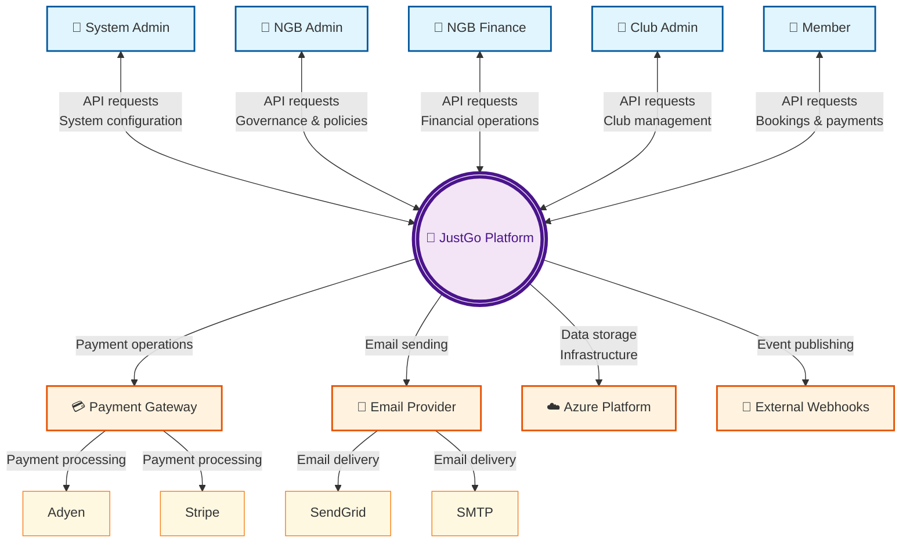

# JustGo Platform - System Context Diagram

> **Document Version:** 1.0
> **Last Updated:** 2026-04-26
> **Author:** System Architecture Team

## Overview

This document provides a comprehensive System Context Diagram for the JustGo Platform, illustrating the relationships between user roles, the JustGo Platform system, external services, and cloud infrastructure.

## System Context Diagram

## Architecture Description

### System Overview

The JustGo Platform is a central REST API system that serves as the core business logic hub, connecting users, external services, and cloud infrastructure.

### User Roles

The platform supports five distinct user types, each with bidirectional API communication with JustGo:

1. **System Admin**: Global system configuration and monitoring
2. **NGB Admin**: National governing body governance and policy management
3. **NGB Finance**: Financial operations and payment reconciliation
4. **Club Admin**: Club-level management and member administration
5. **Member**: End users for bookings, payments, and participation

### External Services

#### Payment Gateway (Abstraction)
- **Purpose**: Unified payment processing interface
- **Implementations**: Adyen, Stripe
- **Configuration**: Toggled via `SYSTEM.PAYMENT.EnableAdyenPayment`

#### Email Provider (Abstraction)
- **Purpose**: Unified email communication interface
- **Implementations**: SendGrid (API-based), SMTP (server-based)
- **Configuration**: Toggled via `SYSTEM.MAIL.SENDGRID`

#### Azure Platform
- **Purpose**: Cloud infrastructure and data storage
- **Services**: SQL Database, Blob Storage, Service Bus, Functions, Redis Cache

#### External Webhooks
- **Purpose**: Event publishing to external systems
- **Architecture**: Outbox pattern via Azure Service Bus and Functions

## Key Design Patterns

### 1. Abstraction Layer
Payment and email services are abstracted to enable provider switching without code changes.

### 2. Event-Driven Architecture
Webhook system uses outbox pattern for reliable event publishing to external systems.

### 3. Multi-tenancy
Supports multiple organizations (NGB, Clubs) with data isolation.

## System Relationships

### User ↔ JustGo (Bidirectional)
- **Inbound**: API requests, authentication, data submissions
- **Outbound**: API responses, notifications, data retrieval

### JustGo ↔ External Services
- **Payment Gateway**: Payment processing and reconciliation
- **Email Provider**: Transactional emails and notifications
- **Azure Platform**: Data storage, caching, and infrastructure
- **External Webhooks**: Business event publishing

## Related Documentation

- [[2.1-product-perspective|Product Perspective]]
- [[4.3-software-interfaces|Software Interfaces]]
- [[DDD-Modular-Monolith-Architecture|Architecture Overview]]

## Version History

| Version | Date | Author | Changes |
|---------|------|--------|---------|
| 1.0 | 2026-04-26 | System Architecture Team | Initial simplified context diagram |
| 1.1 | 2026-04-26 | System Architecture Team | Added payment and email provider abstractions |

---

> **Note**: This simplified context diagram follows C4 Model standards, showing JustGo as the central system with clear bidirectional relationships to users and external services.
